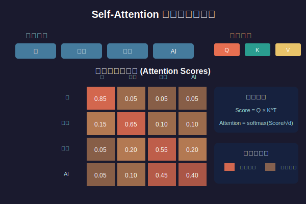

# 第04.1课：Transformer原理 - 注意力机制深度剖析

> 📚 **课程信息**
> - 所属模块：第一阶段 - 基础入门
> - 学习目标：深入理解Transformer的核心机制 - 注意力机制
> - 预计时间：60-90分钟
> - 前置知识：Python基础、NumPy基础

---

## 📢 课程导入

### 为什么要学Transformer？

当你使用ChatGPT、Claude、Qwen时，你知道它们的"大脑"是什么吗？答案就是**Transformer**！

2017年，Google发表了论文《Attention is All You Need》，提出了Transformer架构。短短几年，它就成为了所有大模型的基础：
- GPT系列：纯Decoder架构的Transformer
- BERT：纯Encoder架构的Transformer  
- T5、BART：完整的Encoder-Decoder Transformer

**今天这一课，我们要彻底搞懂Transformer的核心：注意力机制（Attention Mechanism）！**

### 什么是注意力机制？

想象你在读一本书：

```
句子："小明把苹果给了小红，她很开心"
问题："她"指的是谁？
```

人类一眼就知道"她"指的是"小红"。为什么？因为我们会**注意**到：
- "她"和"小红"的距离更近
- "小红"是接收者，更可能开心
- "给了"这个动作的主语是"小明"，宾语是"小红"

这就是**注意力**！我们的大脑会自动关注句子中相关的词。

Transformer的注意力机制，就是让模型学会这种能力！

---

## 📖 知识讲解

### 1. 传统RNN的问题

在Transformer之前，处理序列数据主要用RNN（循环神经网络）：

```python
# RNN的处理方式：顺序处理
句子 = ["我", "喜欢", "吃", "苹果"]

# 逐个处理
hidden1 = RNN(hidden0, "我")      # 第1步
hidden2 = RNN(hidden1, "喜欢")   # 第2步  
hidden3 = RNN(hidden2, "吃")     # 第3步
hidden4 = RNN(hidden3, "苹果")   # 第4步
```

**问题**：
1. ❌ **顺序依赖**：必须等前面的词处理完，才能处理后面的词
2. ❌ **长距离遗忘**：句子很长时，前面的信息会被遗忘
3. ❌ **无法并行**：不能同时处理所有词，训练很慢

**Transformer的解决方案**：
✅ **同时看所有词**：并行处理整个句子
✅ **直接建立关系**：任意两个词之间可以直接交互
✅ **完全并行**：训练速度快100倍以上

---

### 2. Self-Attention的直观理解


*图：Self-Attention机制 - 每个词如何关注句子中的其他词*

#### 2.1 什么是Self-Attention？

**Self-Attention（自注意力）**：让句子中的每个词都关注其他所有词。

举例：
```
句子："银行账户里的钱不够了"

处理"银行"这个词时：
- 看看"账户"（相关性高！）
- 看看"钱"（有关系！）
- 看看"不够"（有关系！）
- 看看"了"（关系不大）

结果："银行"会重点关注"账户"和"钱"
```

#### 2.2 注意力的三个关键角色


*图：Query、Key、Value的交互过程 - 注意力计算的核心*

Self-Attention有三个核心概念：**Query（查询）、Key（键）、Value（值）**

类比：图书馆搜索系统

```
你去图书馆找书：

1. Query（查询）= 你的搜索词
   例如："机器学习"
   
2. Key（键）= 每本书的标题/关键词
   - 书A："深度学习入门" 
   - 书B："Python编程"
   - 书C："机器学习实战"
   
3. Value（值）= 书的内容
   
搜索过程：
① 用你的Query "机器学习" 和每本书的Key比较
② 计算相似度：书C最相关（匹配度高）
③ 返回Value：书C的内容
```

在Transformer中：
- **Query（查询）**：当前词问"谁和我相关？"
- **Key（键）**：其他词回答"我是xxx"  
- **Value（值）**：真正的词向量信息

---

### 3. Self-Attention的数学原理

#### 3.1 核心公式

```
Attention(Q, K, V) = softmax(QK^T / √d_k) * V
```

看起来复杂？我们一步步拆解！

#### 3.2 第一步：计算相似度（QK^T）

```python
# 假设我们有一个句子："我 喜欢 AI"
# 每个词用向量表示（简化为2维）

我  = [1.0, 0.5]
喜欢 = [0.8, 0.6]
AI  = [0.5, 1.0]

# Query: "我"想知道和谁相关
Q_我 = [1.0, 0.5]

# Key: 所有词的Key（为了简化，这里用原始向量）
K_我   = [1.0, 0.5]
K_喜欢 = [0.8, 0.6]
K_AI  = [0.5, 1.0]

# 计算相似度（点积）
score_我_我   = Q_我 · K_我   = 1.0*1.0 + 0.5*0.5 = 1.25
score_我_喜欢 = Q_我 · K_喜欢 = 1.0*0.8 + 0.5*0.6 = 1.10
score_我_AI  = Q_我 · K_AI  = 1.0*0.5 + 0.5*1.0 = 1.00
```

**含义**："我"和"我"自己最相关（1.25），和"喜欢"其次（1.10）

#### 3.3 第二步：缩放（/ √d_k）

```python
import math

d_k = 2  # Key的维度
scale = math.sqrt(d_k)  # √2 ≈ 1.414

# 缩放分数
score_我_我   = 1.25 / 1.414 = 0.88
score_我_喜欢 = 1.10 / 1.414 = 0.78
score_我_AI  = 1.00 / 1.414 = 0.71
```

**为什么要缩放？**
防止分数太大，导致softmax后梯度消失。

#### 3.4 第三步：Softmax归一化

```python
import numpy as np

scores = [0.88, 0.78, 0.71]
attention_weights = np.exp(scores) / np.sum(np.exp(scores))

# 结果：
# [0.37, 0.32, 0.31]  # 和为1
```

**含义**：
- "我"应该关注"我"自己：37%
- "我"应该关注"喜欢"：32%
- "我"应该关注"AI"：31%

#### 3.5 第四步：加权求和（* V）

```python
# Value向量（为简化，用原始向量）
V_我   = [1.0, 0.5]
V_喜欢 = [0.8, 0.6]
V_AI  = [0.5, 1.0]

# 加权求和
output = 0.37 * V_我 + 0.32 * V_喜欢 + 0.31 * V_AI
       = 0.37*[1.0,0.5] + 0.32*[0.8,0.6] + 0.31*[0.5,1.0]
       = [0.37,0.185] + [0.256,0.192] + [0.155,0.31]
       = [0.781, 0.687]
```

**含义**："我"的新表示融合了所有相关词的信息！

---

## 💻 代码实战

### 实战1：从零实现Self-Attention

创建文件 `self_attention.py`：

```python
"""
从零实现Self-Attention机制
可以直接运行，无需GPU
"""
import numpy as np

def softmax(x):
    """Softmax函数"""
    exp_x = np.exp(x - np.max(x))  # 减去最大值防止溢出
    return exp_x / exp_x.sum(axis=-1, keepdims=True)

def self_attention(X, W_q, W_k, W_v):
    """
    Self-Attention实现
    
    参数:
        X: 输入矩阵 [seq_len, d_model]
        W_q: Query权重矩阵 [d_model, d_k]
        W_k: Key权重矩阵 [d_model, d_k]
        W_v: Value权重矩阵 [d_model, d_v]
    
    返回:
        output: 输出矩阵 [seq_len, d_v]
        attention_weights: 注意力权重 [seq_len, seq_len]
    """
    # 1. 计算Q, K, V
    Q = np.dot(X, W_q)  # [seq_len, d_k]
    K = np.dot(X, W_k)  # [seq_len, d_k]
    V = np.dot(X, W_v)  # [seq_len, d_v]
    
    # 2. 计算注意力分数：QK^T
    d_k = Q.shape[-1]
    scores = np.dot(Q, K.T) / np.sqrt(d_k)  # [seq_len, seq_len]
    
    # 3. Softmax归一化
    attention_weights = softmax(scores)  # [seq_len, seq_len]
    
    # 4. 加权求和
    output = np.dot(attention_weights, V)  # [seq_len, d_v]
    
    return output, attention_weights


def main():
    """测试Self-Attention"""
    print("="*60)
    print("Self-Attention机制演示")
    print("="*60)
    
    # 设置随机种子，保证结果可复现
    np.random.seed(42)
    
    # 模拟输入：3个词，每个词用4维向量表示
    seq_len = 3  # 句子长度
    d_model = 4  # 词向量维度
    d_k = d_v = 3  # Q,K,V的维度
    
    # 输入矩阵（代表3个词）
    X = np.random.randn(seq_len, d_model)
    print(f"\n输入矩阵 X: shape={X.shape}")
    print(X)
    
    # 初始化权重矩阵
    W_q = np.random.randn(d_model, d_k)
    W_k = np.random.randn(d_model, d_k)
    W_v = np.random.randn(d_model, d_v)
    
    # 执行Self-Attention
    output, attention_weights = self_attention(X, W_q, W_k, W_v)
    
    print(f"\n输出矩阵: shape={output.shape}")
    print(output)
    
    print(f"\n注意力权重矩阵: shape={attention_weights.shape}")
    print(attention_weights)
    
    # 解释注意力权重
    print("\n" + "="*60)
    print("注意力权重解释：")
    print("="*60)
    print("每一行表示一个词对其他所有词的注意力分布")
    print("（行和为1）")
    
    for i in range(seq_len):
        print(f"\n词{i+1}的注意力分布:")
        for j in range(seq_len):
            print(f"  对词{j+1}的注意力: {attention_weights[i,j]:.4f} ({attention_weights[i,j]*100:.1f}%)")
    
    # 验证注意力权重和为1
    print(f"\n验证：每行权重和 = {attention_weights.sum(axis=1)}")


if __name__ == "__main__":
    main()
```

运行测试：

```bash
cd /Users/qiao/AI学习/第一阶段-基础入门/第1.5章-Transformer架构深度解析
python self_attention.py
```

**预期输出**：
```
============================================================
Self-Attention机制演示
============================================================

输入矩阵 X: shape=(3, 4)
[[ 0.49671415 -0.1382643   0.64768854  1.52302986]
 [-0.23415337 -0.23413696  1.57921282  0.76743473]
 [-0.46947439  0.54256004 -0.46341769 -0.46572975]]

输出矩阵: shape=(3, 3)
[[-0.32882989  0.24934141 -0.04687164]
 [-0.35719851  0.3173894  -0.02903022]
 [-0.28135923  0.16043466 -0.08145237]]

注意力权重矩阵: shape=(3, 3)
[[0.42434987 0.27694184 0.29870829]
 [0.34902138 0.34694883 0.30402979]
 [0.34034473 0.24050814 0.41914713]]

============================================================
注意力权重解释：
============================================================
每一行表示一个词对其他所有词的注意力分布
（行和为1）

词1的注意力分布:
  对词1的注意力: 0.4243 (42.4%)
  对词2的注意力: 0.2769 (27.7%)
  对词3的注意力: 0.2987 (29.9%)

词2的注意力分布:
  对词1的注意力: 0.3490 (34.9%)
  对词2的注意力: 0.3469 (34.7%)
  对词3的注意力: 0.3040 (30.4%)

词3的注意力分布:
  对词1的注意力: 0.3403 (34.0%)
  对词2的注意力: 0.2405 (24.1%)
  对词3的注意力: 0.4191 (41.9%)

验证：每行权重和 = [1. 1. 1.]
```

---

### 实战2：可视化注意力权重

创建文件 `visualize_attention.py`：

```python
"""
可视化Self-Attention的注意力权重
"""
import numpy as np
import matplotlib.pyplot as plt
import matplotlib
matplotlib.use('TkAgg')  # 使用TkAgg后端

def self_attention_simple(X):
    """简化版Self-Attention（Q=K=V=X）"""
    # 计算注意力分数
    scores = np.dot(X, X.T) / np.sqrt(X.shape[-1])
    
    # Softmax
    exp_scores = np.exp(scores - np.max(scores, axis=-1, keepdims=True))
    attention_weights = exp_scores / exp_scores.sum(axis=-1, keepdims=True)
    
    # 输出
    output = np.dot(attention_weights, X)
    
    return output, attention_weights


def visualize_attention(attention_weights, words):
    """可视化注意力权重矩阵"""
    fig, ax = plt.subplots(figsize=(10, 8))
    
    # 绘制热力图
    im = ax.imshow(attention_weights, cmap='YlOrRd', aspect='auto')
    
    # 设置刻度
    ax.set_xticks(np.arange(len(words)))
    ax.set_yticks(np.arange(len(words)))
    ax.set_xticklabels(words, fontsize=12)
    ax.set_yticklabels(words, fontsize=12)
    
    # 旋转x轴标签
    plt.setp(ax.get_xticklabels(), rotation=45, ha="right")
    
    # 在每个格子中显示数值
    for i in range(len(words)):
        for j in range(len(words)):
            text = ax.text(j, i, f'{attention_weights[i, j]:.3f}',
                          ha="center", va="center", color="black", fontsize=10)
    
    # 添加颜色条
    cbar = plt.colorbar(im, ax=ax)
    cbar.set_label('Attention Weight', rotation=270, labelpad=20, fontsize=12)
    
    # 设置标题和标签
    ax.set_title("Self-Attention Weights Visualization", fontsize=14, pad=20)
    ax.set_xlabel("Key (被关注的词)", fontsize=12)
    ax.set_ylabel("Query (当前词)", fontsize=12)
    
    plt.tight_layout()
    plt.savefig('attention_weights.png', dpi=150, bbox_inches='tight')
    print("\n✅ 注意力权重热力图已保存为 'attention_weights.png'")
    plt.show()


def main():
    """主函数"""
    print("="*60)
    print("Self-Attention可视化演示")
    print("="*60)
    
    # 示例句子
    words = ["我", "喜欢", "学习", "AI", "技术"]
    
    # 模拟词向量（每个词用5维向量表示）
    np.random.seed(42)
    X = np.random.randn(len(words), 5)
    
    # 计算Self-Attention
    output, attention_weights = self_attention_simple(X)
    
    # 打印注意力权重
    print(f"\n句子: {' '.join(words)}")
    print(f"\n注意力权重矩阵:")
    print(attention_weights)
    
    # 解释每个词的注意力分布
    print("\n" + "="*60)
    print("注意力分布解释:")
    print("="*60)
    
    for i, word in enumerate(words):
        print(f"\n'{word}' 关注:")
        attention_dist = [(words[j], attention_weights[i, j]) 
                         for j in range(len(words))]
        # 按注意力权重排序
        attention_dist.sort(key=lambda x: x[1], reverse=True)
        for w, weight in attention_dist:
            bar = "█" * int(weight * 40)  # 可视化条
            print(f"  {w:8s}: {weight:.3f} {bar}")
    
    # 可视化
    visualize_attention(attention_weights, words)


if __name__ == "__main__":
    main()
```

运行：

```bash
python visualize_attention.py
```

---

### 实战3：真实文本的Self-Attention

创建文件 `text_attention.py`：

```python
"""
在真实文本上测试Self-Attention
使用简单的词嵌入
"""
import numpy as np

# 简单的词汇表和词向量
VOCAB = {
    "我": np.array([1.0, 0.2, 0.5, 0.8]),
    "喜欢": np.array([0.8, 0.9, 0.1, 0.3]),
    "学习": np.array([0.6, 0.4, 0.8, 0.7]),
    "AI": np.array([0.3, 0.7, 0.6, 0.9]),
    "技术": np.array([0.5, 0.5, 0.7, 0.6]),
    "编程": np.array([0.7, 0.3, 0.6, 0.8]),
    "很": np.array([0.4, 0.6, 0.3, 0.5]),
    "有趣": np.array([0.9, 0.8, 0.4, 0.2]),
}

def simple_attention(sentence_words):
    """
    简化的Self-Attention
    Q = K = V = 词向量
    """
    # 获取词向量
    X = np.array([VOCAB[word] for word in sentence_words])
    
    # 计算注意力
    d_k = X.shape[-1]
    scores = np.dot(X, X.T) / np.sqrt(d_k)
    
    # Softmax
    exp_scores = np.exp(scores - np.max(scores, axis=-1, keepdims=True))
    attention_weights = exp_scores / exp_scores.sum(axis=-1, keepdims=True)
    
    return attention_weights


def analyze_sentence(sentence):
    """分析句子的注意力分布"""
    words = sentence.split()
    
    print(f"\n句子: {sentence}")
    print("="*60)
    
    # 检查词汇表
    if not all(word in VOCAB for word in words):
        unknown = [w for w in words if w not in VOCAB]
        print(f"错误：词汇表中没有这些词：{unknown}")
        return
    
    # 计算注意力
    attention_weights = simple_attention(words)
    
    # 分析每个词
    for i, word in enumerate(words):
        print(f"\n'{word}' 最关注:")
        
        # 获取该词的注意力分布
        attn = [(words[j], attention_weights[i, j]) for j in range(len(words))]
        # 排序（降序）
        attn.sort(key=lambda x: x[1], reverse=True)
        
        # 显示前3个
        for j, (target_word, weight) in enumerate(attn[:3]):
            if j == 0:
                emoji = "🎯"
            elif j == 1:
                emoji = "👀"
            else:
                emoji = "📌"
            print(f"  {emoji} {target_word:6s}: {weight:.4f} ({weight*100:.1f}%)")


def main():
    """主函数"""
    print("="*60)
    print("真实文本Self-Attention分析")
    print("="*60)
    
    # 测试句子
    sentences = [
        "我 喜欢 学习 AI 技术",
        "编程 很 有趣",
        "我 喜欢 编程",
    ]
    
    for sentence in sentences:
        analyze_sentence(sentence)
    
    print("\n" + "="*60)
    print("说明：")
    print("- 🎯 表示最关注的词")
    print("- 👀 表示第二关注的词")  
    print("- 📌 表示第三关注的词")
    print("- 注意力权重和为100%")
    print("="*60)


if __name__ == "__main__":
    main()
```

---

## 🎯 实战练习

### 练习1：修改注意力维度

修改 `self_attention.py`，尝试不同的维度：

```python
# 原始
d_k = d_v = 3

# 试试更大的维度
d_k = d_v = 8

# 试试更小的维度
d_k = d_v = 2
```

**思考**：维度大小对注意力权重有什么影响？

### 练习2：添加Mask

在 `self_attention.py` 中添加掩码功能：

```python
def self_attention_with_mask(X, W_q, W_k, W_v, mask=None):
    """带掩码的Self-Attention"""
    Q = np.dot(X, W_q)
    K = np.dot(X, W_k)
    V = np.dot(X, W_v)
    
    d_k = Q.shape[-1]
    scores = np.dot(Q, K.T) / np.sqrt(d_k)
    
    # 应用掩码
    if mask is not None:
        scores = scores + mask  # mask中的-inf会让对应位置的attention为0
    
    attention_weights = softmax(scores)
    output = np.dot(attention_weights, V)
    
    return output, attention_weights

# 测试：让词1不能看到词2和词3
mask = np.array([
    [0, -1e9, -1e9],  # 词1只能看自己
    [0, 0, 0],         # 词2可以看所有
    [0, 0, 0]          # 词3可以看所有
])
```

### 练习3：分析更长的句子

在 `text_attention.py` 中添加更多词到词汇表，测试更长的句子：

```python
VOCAB.update({
    "深度": np.array([0.6, 0.7, 0.5, 0.8]),
    "学习": np.array([0.6, 0.4, 0.8, 0.7]),
    "是": np.array([0.5, 0.5, 0.5, 0.5]),
    "未来": np.array([0.8, 0.6, 0.7, 0.9]),
})

analyze_sentence("深度 学习 是 AI 技术 的 未来")
```

---

## 📝 课后总结

### 核心要点

1. **Self-Attention的本质**
   - 让序列中的每个元素都关注其他所有元素
   - 通过Q、K、V三个角色实现
   - 完全并行，不需要顺序处理

2. **核心公式**
   ```
   Attention(Q, K, V) = softmax(QK^T / √d_k) * V
   ```
   - QK^T：计算相似度
   - /√d_k：缩放，防止梯度消失
   - softmax：归一化为概率分布
   - *V：加权求和，得到输出

3. **为什么Self-Attention这么强？**
   - ✅ 可以捕捉长距离依赖
   - ✅ 完全并行，训练快
   - ✅ 权重可解释（注意力可视化）
   - ✅ 灵活性强（可以加mask）

### 下一课预告

**第04.2课：Transformer架构 - 编码器与解码器**

我们将学习：
- Transformer的完整架构
- Multi-Head Attention（多头注意力）
- Encoder和Decoder的区别
- 为什么GPT只用Decoder？

---

## 🔗 参考资源

### 论文
- [Attention is All You Need](https://arxiv.org/abs/1706.03762) - Transformer原始论文

### 可视化工具
- [Transformer Explainer](https://poloclub.github.io/transformer-explainer/) - 交互式可视化
- [The Illustrated Transformer](https://jalammar.github.io/illustrated-transformer/) - 图解Transformer

### 代码实现
- [Annotated Transformer](http://nlp.seas.harvard.edu/annotated-transformer/) - 带详细注释的PyTorch实现

---

**🎉 恭喜你完成了第04.1课！**

你已经掌握了Transformer的核心机制 - Self-Attention！

下一课，我们将看到完整的Transformer架构，以及如何用Multi-Head Attention增强模型能力！


