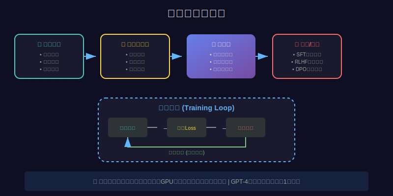
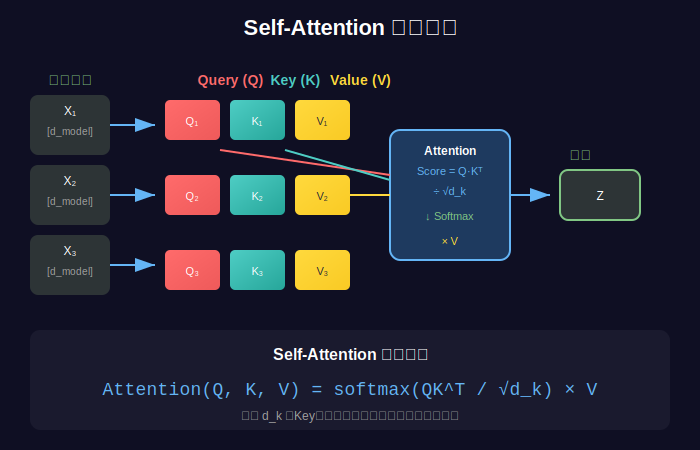

# 第01课：AI大模型是什么？技术原理与应用场景

> 📚 **课程信息**
> - 所属模块：第一模块 - AI基础与环境搭建
> - 学习目标：理解AI大模型的本质、工作原理和应用场景
> - 预计时间：40-60分钟
> - 前置知识：无（零基础可学）

---

## 📢 课程导入

### 前言


*图：神经网络结构示意图 - 大模型的基础架构*

还记得2022年底ChatGPT横空出世的那一刻吗？全球5天突破100万用户，2个月突破1亿用户，打破了所有互联网产品的增长记录！更震撼的是，它竟然能写代码、写文章、做翻译、答疑解惑，甚至通过了美国律师资格考试！这背后的技术，就是我们今天要讲的**AI大模型**。

很多人以为大模型是个黑盒子，离我们很远。但其实，它的原理并不复杂，而且普通开发者完全可以掌握应用开发！今天这一课，我会用最通俗的方式，带你真正理解什么是AI大模型，它是如何工作的，以及我们能用它做什么。

---

### 核心价值点

**第一，大模型不是什么高深莫测的魔法。**

它的本质就是一个**超大规模的神经网络**，通过在海量文本上训练，学会了理解和生成人类语言。就像我们小时候学说话，听多了、练多了，自然就会了。大模型也是这样，只不过它"读过"的文本量是人类一生都无法企及的——几TB甚至几十TB的数据！

**第二，大模型真正革命性的地方，是它的"涌现能力"。**

当模型参数量达到一定规模（通常是几十亿以上），它会突然展现出训练时从未明确教过的能力：推理、规划、代码生成、甚至创意写作。这就像是量变引发质变，GPT-3有1750亿参数时，能力远超1.5亿参数的GPT-2，不是简单的10倍提升，而是质的飞跃！

**第三，大模型开启了一个全新的编程范式。**

过去我们写代码，是告诉计算机"怎么做"（How）；现在我们用大模型，是告诉它"要什么"（What）。只需要用自然语言描述需求，模型就能帮你完成任务。这就是**提示词工程**的魅力，也是为什么它成为了AI时代最重要的技能之一。

**第四，普通开发者的黄金机会来了！**

你不需要懂复杂的算法，不需要训练模型，甚至不需要高端GPU。只要学会调用API、掌握提示词工程、理解RAG和Agent技术，你就能开发出实用的AI应用。这就是为什么现在AI应用开发岗位需求暴增，而门槛却比算法岗低得多！

---

### 行动号召

所以，如果你还在观望，还在犹豫"是不是太难了"、"是不是来不及了"，我想告诉你：**现在正是最好的时机！**

大模型技术已经成熟，工具越来越友好，学习资源越来越丰富。只要你愿意投入3-4个月的时间，系统学习，多做项目，你完全可以掌握这门技能，在AI浪潮中分一杯羹。

从今天开始，从这一课开始，让我们一起踏上AI应用开发的学习之旅！

---

## 📖 知识讲解

### 1. 什么是AI大模型？

#### 1.1 定义

**AI大模型（Large Language Model, LLM）** 是一种基于深度学习的自然语言处理模型，具有以下特征：

- **参数量巨大**：通常有几十亿到几千亿个参数
- **训练数据海量**：在数TB的文本数据上训练
- **能力通用**：可以完成多种不同的任务
- **涌现能力**：展现出训练时未明确教授的能力

#### 1.2 技术演进

```
传统NLP模型（2010-2017）
├─ 词袋模型（Bag of Words）
├─ Word2Vec、GloVe
└─ 问题：无法理解上下文，能力有限

Transformer时代（2017-2020）
├─ 2017: Transformer架构问世
├─ 2018: BERT（双向编码）
├─ 2019: GPT-2（1.5B参数）
└─ 突破：能理解上下文，但能力仍有限

大模型时代（2020-至今）
├─ 2020: GPT-3（175B参数）- 涌现能力首次显现
├─ 2022: ChatGPT - 对话能力革命性突破
├─ 2023: GPT-4 - 多模态能力
├─ 2024: Claude-3、Gemini、Qwen2.5 - 百花齐放
└─ 特点：通用人工智能（AGI）的雏形
```

#### 1.3 大模型的分类

**按照规模分类：**

| 类型 | 参数量 | 代表模型 | 特点 |
|------|--------|----------|------|
| 小型 | <10B | Phi-3(3.8B)、Gemma-7B | 轻量、快速、适合本地 |
| 中型 | 10B-100B | Llama-3.1-70B、Qwen2.5-72B | 平衡性能和成本 |
| 大型 | >100B | GPT-4、Claude-3.5 | 能力最强，成本高 |

**按照训练方式分类：**

| 类型 | 说明 | 代表模型 |
|------|------|----------|
| Base模型 | 只做预训练，没有对齐 | Llama-3.1-Base |
| Instruct模型 | 经过指令微调，理解人类指令 | GPT-4、Qwen2.5-Instruct |
| Chat模型 | 专门优化对话能力 | ChatGPT、Claude |

**按照开源程度分类：**

| 类型 | 开源程度 | 代表模型 |
|------|----------|----------|
| 闭源 | 只能通过API访问 | GPT-4、Claude-3.5 |
| 开源 | 模型权重公开 | Llama-3.1、Qwen2.5 |

---

### 2. 大模型的工作原理

#### 2.1 核心架构：Transformer

大模型的核心是**Transformer架构**，它有两个关键机制：


*图：Transformer完整架构 - 包含编码器和解码器*

**1. 自注意力机制（Self-Attention）**

让模型能理解句子中词与词之间的关系。


*图：Self-Attention机制 - 每个词关注其他所有词*

举例：
```
句子："我喜欢吃苹果"
传统模型：依次处理每个词，容易丢失上下文
Transformer：同时关注所有词，理解"苹果"是"吃"的对象
```

**2. 多头注意力（Multi-Head Attention）**

让模型能从多个角度理解文本。


*图：Multi-Head Attention - 多个"头"从不同角度理解文本*

```
头1：关注语法关系
头2：关注语义关系
头3：关注指代关系
...
最后合并所有视角，得到完整理解
```

#### 2.2 训练过程

大模型的训练通常分为三个阶段：


*图：模型训练流程 - 数据输入→前向传播→损失计算→反向传播→参数更新*

**阶段1：预训练（Pre-training）**

```
目标：学习语言的基本规律
方法：下一个词预测（Next Token Prediction）
数据：海量互联网文本（几TB）
成本：数百万美元，数千块GPU，几个月时间

举例：
输入："今天天气真"
模型学习预测下一个词："好"
```

**阶段2：监督微调（Supervised Fine-Tuning, SFT）**

```
目标：学习遵循人类指令
方法：在高质量的指令-回答对上训练
数据：几万到几十万条高质量样本

举例：
输入："请用Python写一个快速排序"
输出：[完整的快速排序代码]
```

**阶段3：强化学习（RLHF）**

```
目标：对齐人类价值观，更符合人类偏好
方法：基于人类反馈的强化学习
过程：
  1. 人类对模型输出打分
  2. 训练奖励模型
  3. 用奖励模型优化生成策略

效果：更有帮助、更诚实、更无害（HHH原则）
```

#### 2.3 推理过程

当你向大模型提问时，它是这样工作的：


*图：Attention机制的核心 - Query、Key、Value的交互*

```
第1步：分词（Tokenization）
输入："你好，请介绍一下Python"
转换：[你好] [，] [请] [介绍] [一下] [Python]
编码：[123, 45, 678, ...] (token IDs)

第2步：编码（Encoding）
将token IDs转换为向量表示
每个token变成一个高维向量（如4096维）

第3步：前向传播
数据经过几十层Transformer层
每层都在提取和整合信息

第4步：生成（Generation）
预测下一个最可能的token
采样策略：贪婪、束搜索、Top-k、Top-p等

第5步：循环生成
将生成的token加入上下文
继续预测下一个token
直到生成结束符或达到最大长度
```


*图：Seq2Seq模型 - 理解输入序列并生成输出序列*

---

### 3. 大模型的核心能力

#### 3.1 理解能力

- **语义理解**：理解文本含义
- **上下文理解**：理解对话历史
- **意图识别**：理解用户真实需求
- **多语言理解**：支持100+种语言

#### 3.2 生成能力

- **文本生成**：写文章、写故事
- **代码生成**：写Python、Java、JavaScript等
- **创意生成**：写诗、写歌词
- **格式转换**：JSON、CSV、Markdown等

#### 3.3 推理能力

- **逻辑推理**：演绎、归纳推理
- **数学推理**：解方程、计算
- **常识推理**：基于常识判断
- **因果推理**：分析因果关系

#### 3.4 记忆能力

- **短期记忆**：对话历史（上下文窗口）
- **长期记忆**：通过RAG技术扩展
- **工作记忆**：在推理过程中保持状态

---

### 4. 大模型的应用场景

#### 4.1 文本处理

```
✅ 文本生成：自动写作、内容创作
✅ 文本摘要：长文档提取关键信息
✅ 文本翻译：多语言互译
✅ 情感分析：分析评论情感倾向
✅ 信息抽取：从文本中提取结构化信息
```

#### 4.2 对话系统

```
✅ 智能客服：7x24小时自动回答
✅ 个人助手：日程管理、信息查询
✅ 教育陪伴：辅导学习、答疑解惑
✅ 心理咨询：情感支持、倾听陪伴
```

#### 4.3 知识管理

```
✅ 知识问答：基于企业知识库的问答
✅ 文档检索：智能搜索相关文档
✅ 知识图谱：构建和查询知识网络
✅ 专家系统：特定领域的专业助手
```

#### 4.4 代码开发

```
✅ 代码生成：根据需求生成代码
✅ 代码解释：解释代码逻辑
✅ Bug修复：自动检测和修复Bug
✅ 代码审查：检查代码质量
✅ 单元测试：自动生成测试用例
```

#### 4.5 数据分析

```
✅ SQL生成：自然语言转SQL
✅ 数据可视化：生成图表代码
✅ 报告生成：自动生成数据报告
✅ 趋势分析：分析数据趋势
```

#### 4.6 创意设计

```
✅ 内容营销：广告文案、营销策划
✅ 剧本创作：故事、剧本生成
✅ 游戏NPC：智能对话的游戏角色
✅ 音乐歌词：歌词创作
```

---

### 5. 大模型 vs 传统AI

| 维度 | 传统AI | 大模型 |
|------|--------|--------|
| **能力范围** | 单一任务 | 多任务通用 |
| **训练数据** | 少量标注数据 | 海量无标注数据 |
| **迁移能力** | 几乎不能迁移 | 强大的零样本能力 |
| **开发方式** | 特征工程+模型训练 | 提示词工程 |
| **部署成本** | 低 | 较高 |
| **维护成本** | 高（需要持续标注） | 低（提示词迭代） |

---

### 6. 为什么要学习大模型应用开发？

#### 6.1 市场需求旺盛

```
AI应用开发岗位：
- 智联招聘：10000+ 岗位
- Boss直聘：8000+ 岗位
- 拉勾网：5000+ 岗位

平均薪资：
- 初级（0-1年）：15-25K
- 中级（1-3年）：25-40K
- 高级（3-5年）：40-60K
```

#### 6.2 门槛相对较低

```
不需要：
❌ 深度学习算法专家
❌ 数学功底扎实
❌ 高端GPU硬件
❌ 大量训练数据

只需要：
✅ 基础编程能力（Python/Java等）
✅ 理解AI原理（不需要深入）
✅ 掌握提示词工程
✅ 熟悉LangChain等框架
✅ 实战项目经验
```

#### 6.3 技术栈实用

```
学会的技能都能立即用于实战：
✅ 提示词工程 → 立即提升工作效率
✅ API调用 → 快速开发原型
✅ RAG技术 → 构建知识库应用
✅ Agent开发 → 实现自动化任务
```

#### 6.4 职业发展广阔

```
职业路径1：AI应用开发工程师
  → 中级开发 → 高级开发 → 技术专家

职业路径2：AI解决方案工程师
  → 方案设计 → 架构师 → 技术总监

职业路径3：AI产品经理
  → 产品设计 → 产品总监 → 创业

职业路径4：独立开发者
  → 开发AI工具 → SaaS产品 → 创业
```

---

## 🎯 核心概念总结

### 一句话总结

**AI大模型是在海量文本上训练的超大规模神经网络，具有理解、生成、推理等通用能力，普通开发者通过学习提示词工程、API调用、RAG和Agent技术，就能开发实用的AI应用。**

### 关键要点

1. **大模型 = 大参数 + 大数据 + 大算力**
2. **涌现能力是大模型的核心特征**
3. **Transformer是大模型的核心架构**
4. **提示词工程是新的编程范式**
5. **应用开发比算法研究门槛低得多**

---

## 💻 实战练习

虽然这是第一课，我们还没有开始写代码，但你可以先体验一下大模型：

### 练习1：体验ChatGPT

1. 访问 https://chat.openai.com/ （或使用国内镜像）
2. 尝试以下对话：
   ```
   你：请用Python写一个冒泡排序算法
   你：解释一下这段代码的时间复杂度
   你：如何优化这个算法？
   ```
3. 观察：
   - 模型是否理解你的意图？
   - 生成的代码是否正确？
   - 解释是否清晰？

### 练习2：对比不同提示词

尝试同一个任务的不同提问方式：

**提问方式1（模糊）：**
```
"写个排序"
```

**提问方式2（清晰）：**
```
"请用Python语言实现快速排序算法，要求：
1. 代码要有详细注释
2. 包含测试用例
3. 时间复杂度分析"
```

观察两种提问方式的输出质量差异。

### 练习3：思考应用场景

结合你的工作或学习，思考：

1. 哪些重复性工作可以用大模型自动化？
2. 哪些知识查询可以构建智能问答系统？
3. 哪些数据分析任务可以用自然语言驱动？

**写下3个你想实现的AI应用想法。**

---

## 🔍 常见误区

### 误区1："大模型是黑魔法，原理太复杂"

❌ 错误认知：大模型深不可测，普通人学不会

✅ 正确认识：
- 核心原理（Transformer、注意力机制）并不复杂
- **应用开发不需要深入理解算法细节**
- 就像开车不需要懂发动机原理一样

### 误区2："必须训练自己的模型"

❌ 错误认知：学AI就要从头训练模型

✅ 正确认识：
- 训练大模型需要数百万美元成本
- **99%的场景用现成模型就够了**
- 通过API调用、提示词工程、RAG就能解决大部分问题

### 误区3："需要高端GPU和服务器"

❌ 错误认知：没有GPU就学不了AI

✅ 正确认识：
- **本地用LM Studio，普通笔记本16GB内存即可**
- 云端用API，成本极低（DeepSeek每百万token才1元）
- 学习阶段完全可以用免费资源

### 误区4："现在学已经晚了"

❌ 错误认知：大模型技术发展太快，学不过来

✅ 正确认识：
- **基础原理是稳定的**（Transformer、RAG、Agent）
- 新技术是在基础上的改进，不是推倒重来
- 现在正是最好的入场时机，工具越来越成熟

### 误区5："只有算法工程师才能做AI"

❌ 错误认知：AI是算法工程师的专属领域

✅ 正确认识：
- **AI应用开发和算法研究是两个方向**
- 应用开发更重视工程能力和业务理解
- 很多公司更需要应用开发人才

---

## 📚 拓展资源

### 必读文章

1. **Attention Is All You Need**（Transformer原论文）
   - 链接：https://arxiv.org/abs/1706.03762
   - 说明：了解Transformer架构（可选，不必深究数学）

2. **Language Models are Few-Shot Learners**（GPT-3论文）
   - 链接：https://arxiv.org/abs/2005.14165
   - 说明：理解大模型的涌现能力

### 推荐视频

1. **3Blue1Brown - 深度学习原理可视化**
   - 链接：https://www.youtube.com/c/3blue1brown
   - 说明：用动画直观理解神经网络

2. **李宏毅 - ChatGPT原理讲解**
   - 链接：https://www.youtube.com/watch?v=yiY4nPOzJEg
   - 说明：台大教授深入浅出讲解

### 推荐网站

1. **Hugging Face**
   - 链接：https://huggingface.co/
   - 说明：最大的开源模型社区

2. **LangChain文档**
   - 链接：https://python.langchain.com/
   - 说明：后续课程会大量使用

### 推荐书籍

1. **《大语言模型》- 赵鑫等**
   - 清华大学出版社
   - 系统介绍大模型原理和应用

2. **《动手学深度学习》- 李沐**
   - 在线免费：https://zh.d2l.ai/
   - 代码实践为主

---

## 🎯 课后检验

完成本课学习后，你应该能够回答以下问题：

### 基础问题

1. 什么是AI大模型？它和传统NLP模型有什么区别？
2. 大模型的"涌现能力"是什么意思？举例说明。
3. Transformer架构的核心机制是什么？
4. 大模型训练的三个阶段分别是什么？

### 进阶问题

5. 为什么GPT-3比GPT-2能力强那么多？
6. 开源模型和闭源模型各有什么优缺点？
7. Base模型和Instruct模型有什么区别？
8. 大模型应用开发和算法研究有什么区别？

### 应用问题

9. 列举3个你能想到的大模型实际应用场景。
10. 如果要开发一个企业智能客服，需要用到哪些技术？

**如果你能流畅回答8个以上问题，说明本课掌握得很好！**

---

## 📝 下一课预告

**第02课：算法岗 vs 应用开发岗 - 选对方向很重要**

在下一课中，我们将深入对比：
- 算法工程师和应用开发工程师的区别
- 两个岗位的技能要求和职业发展
- 如何根据自己的情况选择合适的方向
- 为什么应用开发更适合大多数人

记住：选对方向，比盲目努力更重要！

---

**🎉 恭喜你完成第一课！**

现在你已经理解了AI大模型的基本概念，接下来让我们一起探索这个激动人心的领域！

**下一步：** 打开 `第02课-算法岗vs应用开发岗.md`，了解职业发展方向！

