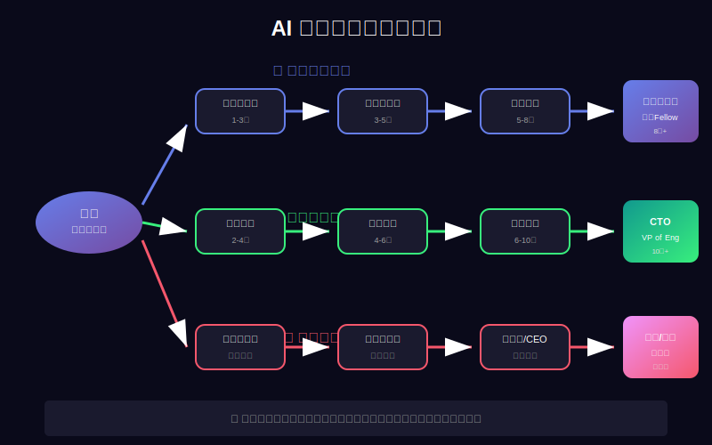
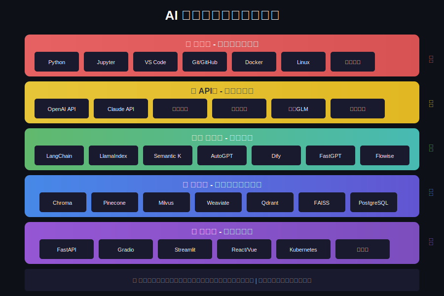
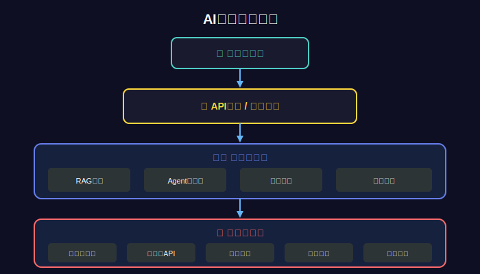
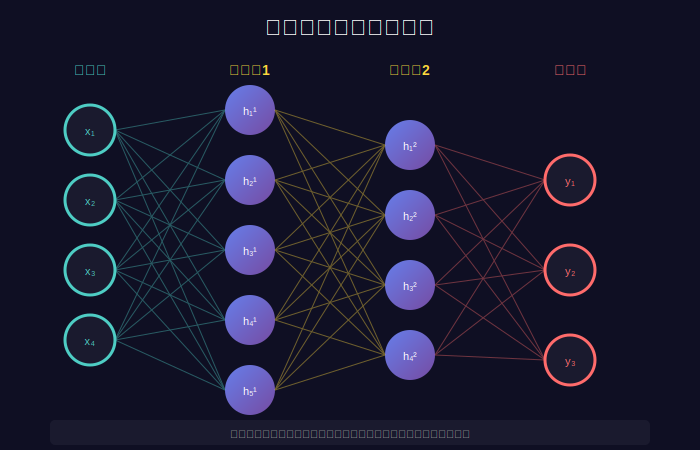

# 第02课：算法岗 vs 应用开发岗 - 选对方向很重要

> 📚 **课程信息**
> - 所属模块：第一模块 - AI基础与环境搭建
> - 学习目标：明确算法岗和应用开发岗的区别，找到适合自己的发展方向
> - 预计时间：30-40分钟
> - 前置知识：第01课 - AI大模型是什么

---

## 📢 课程导入


*图：AI领域的职业发展路径 - 选对方向比努力更重要*

### 前言

我见过太多这样的案例：一个普通本科生，埋头苦学深度学习算法半年，啃了一堆论文，复现了十几个模型，最后投了80份简历，连一个面试机会都没有。为什么？因为他一开始就选错了方向！

他的目标是"算法工程师"，但这个岗位明明写着"985硕士起步，博士优先"。而与此同时，大量的"AI应用开发"岗位却在疯狂招人，本科就能胜任，薪资还不低！

今天这一课，我要用最真实的数据和案例，告诉你**算法岗和应用开发岗的本质区别**，帮你避开90%的人都会踩的坑。选对方向，真的比盲目努力重要100倍！

---

### 核心价值点

**第一，算法岗和应用开发岗是完全不同的两个职业。**

很多人以为学AI就要搞算法，其实大错特错！算法岗是做什么的？**研究和改进模型本身**，比如提出新的网络结构、优化训练方法、提升模型性能。这需要深厚的数学功底、扎实的算法基础，还要能看懂和写论文。

而应用开发岗呢？是**用现成的模型解决实际问题**，比如开发智能客服、搭建知识库问答系统、实现AI代码助手。这需要的是工程能力、业务理解、快速落地，根本不用你去改进算法！

**第二，从招聘需求看，应用开发岗的机会是算法岗的10倍以上。**

我在各大招聘网站搜索了一下：
- "算法工程师"岗位：约1000个，但80%要求硕士，60%要求985/211
- "AI应用开发"岗位：约10000个，大部分本科即可，经验比学历重要

为什么差这么多？因为**真正需要改进模型的场景很少**，大部分公司要的是"能用AI技术解决业务问题的人"，而不是"研究新算法的人"。

**第三，应用开发的学习曲线更友好，上手更快。**

学算法要什么？线性代数、概率论、信息论、最优化理论...光基础数学就要几个月。然后还要学PyTorch、看论文、复现代码、调参训练，没有一年时间根本不够。

而应用开发呢？**会基础编程就能入门**，学习提示词工程、API调用、LangChain框架、RAG和Agent技术，3-4个月就能掌握核心技能，马上就能开发项目！

**第四，薪资差距没你想象的那么大，成长空间甚至更广。**

算法岗：初级20-30K，中级30-50K，但天花板也就在那里
应用开发岗：初级15-25K，中级25-40K，高级40-60K+

更关键的是，应用开发的职业路径更多元：
- 可以转产品经理（懂技术的PM很值钱）
- 可以做技术架构师（系统设计能力更重要）
- 可以创业做SaaS（直接面向市场）

而算法岗如果不继续深造，职业路径相对单一。

---

### 行动号召

所以，如果你：
- ✅ 不是985/211硕士以上学历
- ✅ 数学基础一般，对论文不感冒
- ✅ 更喜欢解决实际问题，而不是做理论研究
- ✅ 希望快速上手，3-4个月就能出成果
- ✅ 想要有更多的职业发展可能性

**那么，AI应用开发就是你的最佳选择！**

这个课程就是为应用开发设计的，接下来的100多节课，我会带你系统掌握所有需要的技能。不需要深奥的数学，不需要昂贵的GPU，只需要你的时间、耐心和实践！

---

## 📖 知识讲解

### 1. 算法岗 vs 应用开发岗：全面对比

#### 1.1 核心工作内容

| 维度 | 算法工程师 | AI应用开发工程师 |
|------|-----------|----------------|
| **主要工作** | 研究和改进模型 | 用模型解决问题 |
| **日常任务** | 看论文、提出创新点<br>设计网络结构<br>优化训练流程<br>写论文和专利 | 需求分析<br>系统设计<br>API集成<br>提示词优化<br>上线部署 |
| **工作产出** | 论文、专利<br>新模型、新方法<br>性能指标提升 | AI应用系统<br>功能模块<br>用户体验提升 |
| **技术栈** | PyTorch/TensorFlow<br>论文复现<br>模型训练<br>分布式训练 | LangChain<br>API调用<br>向量数据库<br>RAG、Agent<br>FastAPI |

---

#### 1.2 技能要求对比


*图：算法岗 vs 应用开发岗的技能栈对比*

**算法工程师需要的核心技能：**

```
数学基础（70%重要性）
├─ 线性代数：矩阵运算、特征值分解
├─ 概率统计：概率分布、贝叶斯理论
├─ 最优化：梯度下降、凸优化
└─ 信息论：熵、互信息

算法能力（80%重要性）
├─ 深度学习：CNN、RNN、Transformer等
├─ 机器学习：传统ML算法
├─ 优化技巧：正则化、Dropout、BN等
└─ 损失函数设计

编程能力（60%重要性）
├─ PyTorch/TensorFlow
├─ CUDA编程（可选）
├─ 分布式训练
└─ 模型部署

科研能力（70%重要性）
├─ 论文阅读能力
├─ 实验设计能力
├─ 论文写作能力
└─ 创新思维
```

**AI应用开发工程师需要的核心技能：**

```
编程基础（80%重要性）
├─ Python基础（必须）
├─ Java/Go（加分项）
├─ Web开发（FastAPI、Flask）
└─ 数据库（SQL、向量数据库）

AI应用技能（90%重要性）
├─ 提示词工程（最重要！）
├─ API调用（OpenAI、本地模型）
├─ LangChain框架
├─ 向量数据库（Chroma、Milvus）
├─ RAG技术
└─ Agent开发

工程能力（85%重要性）
├─ 系统设计
├─ API开发
├─ 代码规范
├─ 测试部署
├─ 性能优化
└─ Docker/K8s

业务能力（75%重要性）
├─ 需求分析
├─ 技术选型
├─ 方案设计
└─ 沟通协作

数学基础（20%重要性）
├─ 基本概念理解即可
└─ 不需要深入数学推导
```

**重要发现：应用开发不需要很强的数学基础！**

---

#### 1.3 学历和背景要求

**算法岗真实招聘要求（统计自主流招聘网站）：**

```
学历要求：
- 硕士及以上：80%
- 985/211：60%
- 海外名校：20%
- 博士优先：40%

背景要求：
- 顶会论文：30%的岗位要求
- 竞赛获奖：20%的岗位要求
- 知名实验室：加分项
- 相关项目：必须

现实案例：
❌ 本科 + 半年自学 → 简历通过率 < 5%
⚠️ 硕士 + 无论文 → 简历通过率约 30%
✅ 硕士 + 顶会论文 → 简历通过率约 70%
✅ 博士 + 顶会论文 → 基本都能过简历
```

**应用开发岗真实招聘要求：**

```
学历要求：
- 本科及以上：90%
- 专业不限：70%
- 培训班转行：也有机会

背景要求：
- 编程基础：必须
- AI项目经验：重要（可以自己做）
- 开源贡献：加分
- 实际应用：最重要

现实案例：
✅ 本科 + 3个完整项目 → 简历通过率约 60%
✅ 培训班 + 1年经验 → 简历通过率约 40%
✅ 大专 + 丰富项目 → 也有机会（看能力）
```

**结论：应用开发对学历要求宽松很多，更看重实际能力！**

---

#### 1.4 薪资对比（2024年数据）

| 级别 | 算法工程师 | AI应用开发 | 说明 |
|------|-----------|-----------|------|
| **实习生** | 200-300/天 | 150-250/天 | 算法稍高 |
| **应届生** | 20-30K | 15-25K | 算法稍高 |
| **1-3年** | 30-50K | 25-40K | 差距缩小 |
| **3-5年** | 50-80K | 40-60K | 高级开发追上 |
| **5年+** | 80-120K | 60-100K+ | 看个人能力 |

**重要发现：**
1. 初期算法岗薪资略高，但差距不大（3-5K）
2. 中期差距进一步缩小
3. 高级阶段主要看个人能力，而不是岗位
4. 应用开发转管理、转创业机会更多

---

#### 1.5 职业发展路径


*图：AI系统架构 - 应用开发需要的系统设计能力*

**算法工程师职业路径：**

```
初级算法工程师（0-2年）
  ↓
中级算法工程师（2-4年）
  ↓
高级算法工程师（4-7年）
  ↓
选择1: 算法专家/科学家（继续研究）
选择2: 算法团队Leader（管理方向）
选择3: 继续读博（学术方向）

特点：
✅ 路径清晰但相对单一
✅ 持续需要跟进最新论文
⚠️ 35岁后竞争力下降
⚠️ 转行成本高
```

**AI应用开发工程师职业路径：**

```
初级AI应用开发（0-2年）
  ↓
中级AI应用开发（2-4年）
  ↓
多元化发展：

路径1: 技术专家方向
  → 高级开发 → 架构师 → 技术总监

路径2: 产品方向
  → AI产品经理 → 产品总监 → CPO

路径3: 解决方案方向
  → 解决方案工程师 → 架构师 → 技术总监

路径4: 创业方向
  → 开发AI工具/SaaS → 创业

路径5: 自由职业
  → 独立开发者 → 接项目/做产品

特点：
✅ 路径多元化
✅ 更容易转型
✅ 35岁后可以做管理/架构/创业
✅ 技能更通用，不容易被淘汰
```

---

### 2. 真实案例分析

#### 案例1：算法岗的困境

**小李的故事：**

```
背景：
- 211本科，计算机专业
- 自学深度学习半年
- 复现了10+个经典模型
- GitHub有自己的项目

求职过程：
- 投递：80份算法岗简历
- 回应：3家要求面试
- 原因：学历不达标（本科）、无论文、无大厂实习

结果：
- 最终面试3家都挂了（都说基础不够）
- 反思后转战应用开发岗
- 1个月后拿到2个offer

教训：
❌ 选择了不适合自己的赛道
❌ 没有认清自己的优势和劣势
✅ 转方向后才找到正确的路
```

#### 案例2：应用开发的逆袭

**小张的故事：**

```
背景：
- 普通二本，非CS专业
- 做过2年Java开发
- 对AI感兴趣，自学3个月

学习路径：
- 学习提示词工程（2周）
- 学习LangChain框架（3周）
- 学习RAG技术（4周）
- 做了3个完整项目（5周）

求职过程：
- 投递：30份AI应用开发简历
- 回应：12家要求面试
- 原因：项目经验扎实，代码规范

结果：
- 拿到3个offer
- 最终选择一家创业公司（25K）
- 半年后升职加薪（35K）

成功因素：
✅ 选对了适合自己的方向
✅ 扎实的项目经验
✅ 之前的开发经验加分
✅ 学习方法正确（实战为主）
```

#### 案例3：转型成功的Java工程师

**老王的故事（可能和你类似）：**

```
背景：
- 5年Java后端开发经验
- 30岁，想要转型AI
- 担心年龄大、没学历

学习过程：
- 利用下班时间学习（4个月）
- 做了2个企业级AI项目
- 参与开源项目贡献

优势：
✅ 工程能力强（后端经验）
✅ 理解业务需求
✅ 代码规范，测试意识强
✅ 系统设计能力强

结果：
- 内部转岗成功
- 薪资从25K涨到40K
- 成为公司AI应用负责人

启示：
✅ 有开发经验转AI应用开发有巨大优势
✅ 年龄不是问题，经验是优势
✅ 工程能力在AI应用开发中非常重要
```

---

### 3. 如何选择适合自己的方向

#### 3.1 选择算法岗的条件（需要满足大部分）

```
✅ 硕士及以上学历（985/211优先）
✅ 数学基础扎实（线代、概率论、最优化）
✅ 热爱科研，喜欢看论文
✅ 有耐心做长期研究
✅ 有相关竞赛获奖或论文发表
✅ 有充足时间（至少1-2年）
✅ 愿意持续深造（可能读博）
```

**如果满足5个以上 → 可以考虑算法岗**
**如果满足3个以下 → 强烈建议选应用开发**

---

#### 3.2 选择应用开发岗的条件（满足部分即可）

```
✅ 有编程基础（任何语言都行）
✅ 更喜欢解决实际问题
✅ 希望快速上手和产出
✅ 工程能力强于理论能力
✅ 对业务理解和系统设计感兴趣
✅ 想要更灵活的职业发展
✅ 学历普通但能力强
```

**如果满足4个以上 → 应用开发是你的菜！**

---

#### 3.3 特殊人群建议

**Java/后端工程师转AI：**
```
✅ 强烈推荐应用开发岗
✅ 你的工程能力是巨大优势
✅ 系统设计经验直接可用
✅ API开发经验直接可用
✅ 3-4个月就能转型成功
```

**应届生/在校生：**
```
如果：
- 985/211硕士 + 数学好 → 可以尝试算法岗
- 普通本科 + 工程能力强 → 建议应用开发
- 专科 + 自学能力强 → 建议应用开发
```

**35岁+转型：**
```
✅ 强烈推荐应用开发
✅ 你的经验和业务理解是核心竞争力
✅ 应用开发更看重综合能力
✅ 职业发展路径更多元
```

**零基础小白：**
```
✅ 建议应用开发
✅ 学习曲线更友好
✅ 更快看到成果，保持动力
✅ 就业机会更多
```

---

### 4. AI应用开发的核心技能图谱


*图：神经网络基础 - 理解原理即可，不需要深入数学*

```
核心技能树：

第一层：基础能力（必须）
├─ Python编程（⭐⭐⭐⭐⭐）
├─ Git版本控制（⭐⭐⭐⭐）
├─ Linux基础（⭐⭐⭐）
└─ HTTP/API知识（⭐⭐⭐⭐）

第二层：AI基础（必须）
├─ 提示词工程（⭐⭐⭐⭐⭐）
├─ AI原理理解（⭐⭐⭐）
├─ API调用（OpenAI/本地）（⭐⭐⭐⭐⭐）
└─ 常见模型了解（⭐⭐⭐）

第三层：框架工具（必须）
├─ LangChain（⭐⭐⭐⭐⭐）
├─ 向量数据库（⭐⭐⭐⭐）
├─ FastAPI（⭐⭐⭐⭐）
└─ Streamlit（可选）（⭐⭐⭐）

第四层：核心技术（必须）
├─ RAG技术（⭐⭐⭐⭐⭐）
├─ Agent开发（⭐⭐⭐⭐）
├─ Memory管理（⭐⭐⭐⭐）
└─ Embedding技术（⭐⭐⭐⭐）

第五层：工程能力（重要）
├─ 代码规范（⭐⭐⭐⭐）
├─ 单元测试（⭐⭐⭐⭐）
├─ Docker部署（⭐⭐⭐⭐）
├─ CI/CD（⭐⭐⭐）
└─ 性能优化（⭐⭐⭐⭐）

第六层：业务能力（重要）
├─ 需求分析（⭐⭐⭐⭐）
├─ 系统设计（⭐⭐⭐⭐）
├─ 技术选型（⭐⭐⭐⭐）
└─ 成本评估（⭐⭐⭐）
```

**重点：本课程会系统教授以上所有技能！**

---

## 🎯 核心要点总结

### 一句话总结

**算法岗是研究模型本身（需要高学历和强数学），应用开发岗是用模型解决问题（需要工程能力和业务理解），后者门槛更低、机会更多、发展更灵活，更适合大多数人。**

### 关键决策点

1. **看学历**：硕士以上 → 可考虑算法岗；本科及以下 → 建议应用开发
2. **看兴趣**：喜欢研究理论 → 算法岗；喜欢解决实际问题 → 应用开发
3. **看时间**：有1-2年时间 → 可学算法；希望3-4月上手 → 应用开发
4. **看机会**：算法岗少（约1000个）；应用开发多（约10000个）
5. **看发展**：算法岗单一；应用开发多元

---

## 💻 实战练习

### 练习1：职业自我评估

根据以下维度给自己打分（1-5分）：

```
算法岗倾向评分：
□ 学历：___ 分（专科1分，本科2分，硕士4分，博士5分）
□ 数学：___ 分（1=不好，5=很好）
□ 科研：___ 分（1=不喜欢，5=很喜欢）
□ 理论：___ 分（1=不喜欢，5=很喜欢）
□ 时间：___ 分（1=很急，5=充裕）

总分：___ 分

应用开发倾向评分：
□ 编程：___ 分（1=不会，5=很熟练）
□ 工程：___ 分（1=不关注，5=很关注）
□ 业务：___ 分（1=不理解，5=很理解）
□ 实战：___ 分（1=不喜欢，5=很喜欢）
□ 快速：___ 分（1=不着急，5=想快速上手）

总分：___ 分
```

**结果分析：**
- 算法岗得分 > 18分 → 可以考虑算法岗
- 应用开发得分 > 18分 → 建议应用开发岗
- 两者都高 → 都可以，建议先从应用开发入手

### 练习2：岗位需求分析

访问招聘网站（智联、Boss、拉勾），搜索：

1. **"算法工程师 + 你所在城市"**
   - 记录岗位数量：___
   - 查看3个岗位的要求
   - 评估自己能投几个：___

2. **"AI应用开发 + 你所在城市"**
   - 记录岗位数量：___
   - 查看3个岗位的要求
   - 评估自己能投几个：___

**对比分析，哪个更适合你？**

### 练习3：职业规划

写下你的3年职业规划：

```
第1年目标：
- 技能：
- 项目：
- 目标公司：

第2年目标：
- 职位：
- 薪资：
- 能力提升：

第3年目标：
- 职位：
- 发展方向：
- 长期规划：
```

---

## 🔍 常见问题

### Q1: 我是Java工程师，转AI应用开发有优势吗？

✅ **非常有优势！**

你的优势：
1. 编程能力扎实
2. 工程思维成熟
3. 系统设计经验丰富
4. 代码规范意识强
5. 理解业务需求

只需要补充：
- Python语法（1-2周）
- AI基础知识（2-3周）
- LangChain框架（3-4周）
- 做2-3个项目（4-6周）

**总共3个月就能转型成功！**

---

### Q2: 30岁了才想转AI，来得及吗？

✅ **完全来得及，而且有优势！**

30岁的优势：
1. 工作经验丰富
2. 业务理解深刻
3. 心智更成熟
4. 学习更有目标

建议：
- 选择应用开发方向（而非算法）
- 利用你的业务理解优势
- 做深入的垂直领域应用
- 往架构师方向发展

**很多30+转型成功的案例！**

---

### Q3: 非CS专业，能学AI应用开发吗？

✅ **可以，而且有独特优势！**

不同专业的优势：
- 金融专业 → 做金融AI应用
- 医学专业 → 做医疗AI应用
- 法律专业 → 做法律AI助手
- 教育专业 → 做教育AI产品

**专业背景 + AI技能 = 复合型人才！**

---

### Q4: 学完应用开发，还能转算法岗吗？

✅ **可以，而且更容易！**

应用开发 → 算法岗：
1. 有实际应用经验（知道哪些场景需要优化）
2. 有工程能力（更容易落地）
3. 有业务理解（研究更有针对性）

但反过来（算法 → 应用）会更难，因为：
- 缺少工程经验
- 不理解业务需求
- 代码规范意识弱

**建议：先应用后算法，路更宽！**

---

### Q5: 培训班出来的，能找到工作吗？

✅ **可以，关键看你的项目和能力！**

提升竞争力的方法：
1. **做3个以上完整项目**（最重要！）
2. 参与开源项目贡献
3. 写技术博客
4. 准备GitHub作品集
5. 掌握扎实的工程能力

**记住：能力 > 学历 > 背景**

---

## 📚 拓展资源

### 岗位分析文章

1. **《2024年AI招聘市场报告》**
   - Boss直聘研究院
   - 了解真实的市场需求

2. **《算法工程师和AI应用开发工程师的区别》**
   - 知乎热门话题
   - 真实从业者的经验分享

### 职业规划建议

1. **领英（LinkedIn）**
   - 搜索"AI Application Engineer"
   - 看看这个岗位的人都是什么背景

2. **脉脉**
   - 搜索相关岗位
   - 了解薪资和发展

---

## 🎯 课后检验

完成本课后，你应该能够清楚回答：

1. 算法岗和应用开发岗的核心区别是什么？
2. 两个岗位分别需要什么样的技能？
3. 你更适合哪个方向？为什么？
4. 你的优势和劣势分别是什么？
5. 你的3年职业规划是什么？

**如果都能清晰回答，说明你已经明确了方向！**

---

## 📝 下一课预告

**第03课：大模型应用开发技术栈全景图**

在下一课中，我们将全面介绍：
- AI应用开发需要掌握的完整技术栈
- 每个技术的作用和重要性
- 学习路线和优先级
- 如何构建自己的知识体系

**明确了方向，接下来就要规划路线了！**

---

**🎉 恭喜你完成第二课！**

现在你已经明确了职业方向，接下来让我们一起规划学习路径！

**下一步：** 打开 `第03课-技术栈全景图.md`

