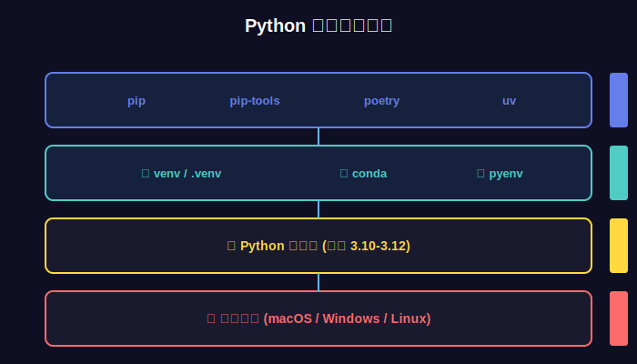

# 第05课：Python环境配置与虚拟环境

> 📚 **课程信息**
> - 所属模块：第一模块 - AI基础与环境搭建
> - 学习目标：配置Python开发环境，掌握虚拟环境管理
> - 预计时间：40-60分钟
> - 前置知识：第01-04课

---

## 📢 课程导入


*图：Python开发环境生态 - 从解释器到框架的完整栈*

### 前言

你知道为什么很多新手学Python学着学着就放弃了吗？不是因为Python难，而是因为**环境配置就把人劝退了**！今天装这个库，明天装那个库，后天发现版本冲突了，代码跑不起来，最后心态崩了。

但其实，只要掌握了正确的环境配置方法，这些问题都不存在！今天这一课，我会手把手教你配置一个专业的Python开发环境，而且让你学会一个神器——虚拟环境。有了它，你的开发环境永远干净整洁，再也不会出现版本冲突！

---

### 核心价值点

**第一，虚拟环境是专业开发者的标配，不是可选项。**

很多新手直接在系统Python上装包，结果项目A需要某个库的1.0版本，项目B需要2.0版本，一装就冲突。但专业开发者从来不会遇到这个问题，为什么？因为他们给每个项目都创建独立的虚拟环境！

就像每个项目有自己的独立空间，互不干扰。这不仅避免了冲突，还能让你的项目在任何电脑上一键复现环境。这就是专业和业余的区别！

**第二，正确的工具能让你的开发效率提升十倍。**

手动管理环境？太原始了！现在有这么多好工具：venv、virtualenv、conda、poetry...选对工具，创建环境只需要一行命令，切换环境也是一秒钟的事。

而且好的IDE配置能让你写代码如虎添翼：自动补全、实时检查、一键运行。这些工具不是花哨，而是实实在在提升效率！

**第三，环境配置做好了，后面的学习会顺畅无比。**

很多人学AI的时候，不是卡在技术上，而是卡在环境问题上：导包报错、版本不兼容、找不到模块...浪费大量时间在这些琐事上。

但如果你一开始就配置好环境，后面的学习会非常顺畅。所有示例代码拿来就能跑，所有库都能正常使用，你可以把100%的精力放在学习技术上！

**第四，好的开发习惯是从第一天养成的。**

今天多花一小时配置环境，未来能省下几百小时的调试时间。今天养成使用虚拟环境的习惯，未来你的项目永远不会乱。今天学会专业的工具链，未来你就是专业的开发者。

记住，**高手和菜鸟的区别，往往体现在这些看似不起眼的地方！**

---

### 行动号召

所以今天这一课，请你一定要动手跟着做！不要只是看看就过了，一定要：
- 在自己电脑上配置环境
- 创建第一个虚拟环境
- 安装必要的包
- 运行第一个程序

**配置好环境，你就真正开始AI开发之旅了！**

---

## 📖 知识讲解

### 1. 为什么需要虚拟环境？

#### 1.1 没有虚拟环境的问题

```
场景：你的电脑只有一个Python环境

项目A：需要 langchain==0.0.100
项目B：需要 langchain==0.1.0

问题：
❌ 两个版本无法共存
❌ 安装新版会覆盖旧版
❌ 项目A无法运行了！

更严重的问题：
❌ 全局安装的包越来越多
❌ 不知道哪些包是哪个项目需要的
❌ 换电脑无法复现环境
❌ 团队协作时环境不一致
```

#### 1.2 有虚拟环境的好处


*图：独立的虚拟环境让每个项目都有自己的依赖栈*

```
场景：每个项目都有独立的虚拟环境

项目A虚拟环境：langchain==0.0.100
项目B虚拟环境：langchain==0.1.0

好处：
✅ 各项目依赖互不干扰
✅ 环境干净整洁
✅ 可以导出依赖列表（requirements.txt）
✅ 团队协作环境一致
✅ 随时可以删除重建
```

---

### 2. Python版本选择

#### 2.1 推荐版本

```
✅ 推荐：Python 3.10.x（最佳选择）
  - 稳定性好
  - 兼容性强
  - 大部分AI库都支持

✅ 备选：Python 3.11.x
  - 更快
  - 新特性
  - 部分库可能不兼容

⚠️ 不推荐：Python 3.12+
  - 太新，很多库不兼容
  - 容易遇到问题

❌ 不要用：Python 3.8及以下
  - 太老，部分新特性不支持
  - 某些库已经不支持
```

---

### 3. 虚拟环境工具对比

#### 3.1 主流工具

| 工具 | 优点 | 缺点 | 推荐场景 |
|------|------|------|----------|
| **venv** | Python内置<br>轻量级<br>简单 | 功能较少 | ✅ 本课程推荐<br>简单项目 |
| **virtualenv** | 功能更强<br>速度更快 | 需要额外安装 | 复杂项目 |
| **conda** | 管理Python版本<br>适合科学计算 | 体积大<br>速度慢 | 数据科学项目 |
| **poetry** | 现代化<br>依赖管理强 | 学习曲线陡 | 大型项目 |

**本课程使用venv**：
- Python内置，无需安装
- 简单易用
- 满足学习需求

---

### 4. 开发工具选择

#### 4.1 IDE推荐

**VSCode（强烈推荐）**
```
优点：
✅ 免费开源
✅ 轻量快速
✅ 插件丰富
✅ AI辅助编程（GitHub Copilot）
✅ 跨平台

适合人群：所有人
```

**PyCharm（可选）**
```
优点：
✅ 功能强大
✅ 专为Python设计
✅ 调试功能强

缺点：
⚠️ 专业版收费
⚠️ 比较重

适合人群：专业Python开发者
```

**Cursor（AI编程神器）**
```
优点：
✅ 基于VSCode
✅ 内置AI助手
✅ 代码补全强大

缺点：
⚠️ 部分功能收费

适合人群：追求效率的开发者
```

---

## 💻 实战操作

### 环境配置步骤（Windows）

#### 第一步：安装Python

1. **下载Python**
   - 访问：https://www.python.org/downloads/
   - 下载Python 3.10.x（推荐3.10.11）

2. **安装Python**
   - 双击安装程序
   - **⚠️ 重要：勾选"Add Python to PATH"**
   - 点击"Install Now"
   - 等待安装完成

3. **验证安装**
   - 打开CMD或PowerShell
   - 输入命令验证

```bash
# 查看Python版本
python --version
# 应该输出：Python 3.10.11

# 查看pip版本
pip --version
# 应该输出：pip 23.x.x
```

---

#### 第二步：创建项目目录

```bash
# 创建学习目录
mkdir D:\AI_Learning
cd D:\AI_Learning

# 创建第一个项目目录
mkdir hello_ai
cd hello_ai
```

---

#### 第三步：创建虚拟环境

```bash
# 创建虚拟环境（名为venv）
python -m venv venv

# 查看目录结构
dir
# 应该看到一个venv文件夹
```

虚拟环境目录结构：
```
hello_ai/
├── venv/
│   ├── Scripts/        # Windows下的可执行文件
│   ├── Lib/           # 安装的包
│   └── Include/       # 头文件
```

---

#### 第四步：激活虚拟环境

```bash
# Windows CMD
venv\Scripts\activate

# Windows PowerShell（如果上面的不行）
venv\Scripts\Activate.ps1

# 激活成功后，命令行前面会显示(venv)
(venv) D:\AI_Learning\hello_ai>
```

如果PowerShell报错"无法加载文件"，执行：
```powershell
# 以管理员身份运行PowerShell
Set-ExecutionPolicy RemoteSigned

# 然后再激活
venv\Scripts\Activate.ps1
```

---

#### 第五步：安装基础包

```bash
# 确保激活了虚拟环境（命令行前有(venv)）

# 升级pip
python -m pip install --upgrade pip

# 安装基础包
pip install openai python-dotenv

# 验证安装
pip list
```

---

### 环境配置步骤（macOS/Linux）

#### 第一步：安装Python

**macOS:**
```bash
# 使用Homebrew安装
brew install python@3.10

# 验证
python3 --version
pip3 --version
```

**Linux (Ubuntu/Debian):**
```bash
# 更新包管理器
sudo apt update

# 安装Python 3.10
sudo apt install python3.10 python3.10-venv python3-pip

# 验证
python3.10 --version
pip3 --version
```

---

#### 第二步：创建项目和虚拟环境

```bash
# 创建项目目录
mkdir -p ~/AI_Learning/hello_ai
cd ~/AI_Learning/hello_ai

# 创建虚拟环境
python3.10 -m venv venv

# 激活虚拟环境
source venv/bin/activate

# 激活成功后命令行前面显示(venv)
(venv) user@computer:~/AI_Learning/hello_ai$
```

---

#### 第三步：安装基础包

```bash
# 升级pip
pip install --upgrade pip

# 安装基础包
pip install openai python-dotenv

# 验证安装
pip list
```

---

### 配置VSCode（推荐）

#### 第一步：安装VSCode

1. 访问：https://code.visualstudio.com/
2. 下载并安装

#### 第二步：安装Python扩展

1. 打开VSCode
2. 点击左侧扩展图标（或按 Ctrl+Shift+X）
3. 搜索"Python"
4. 安装Microsoft官方的Python扩展

#### 第三步：配置Python解释器

1. 打开项目文件夹：文件 → 打开文件夹 → 选择hello_ai
2. 按 Ctrl+Shift+P 打开命令面板
3. 输入"Python: Select Interpreter"
4. 选择虚拟环境中的Python（路径包含venv的那个）

---

## 🎯 Demo案例：Hello AI World

### 案例说明

创建第一个AI程序，验证环境配置成功。

### 第一步：创建项目结构

```bash
# 在hello_ai目录下创建以下结构
hello_ai/
├── venv/              # 虚拟环境（已创建）
├── .env              # 环境变量配置
├── hello_ai.py       # 主程序
└── requirements.txt  # 依赖列表
```

---

### 第二步：配置环境变量

创建`.env`文件（项目根目录）：

```bash
# .env 文件内容

# 本地LM Studio配置（主用）
LOCAL_LLM_BASE_URL=http://localhost:1234/v1
LOCAL_LLM_API_KEY=lm-studio
LOCAL_LLM_MODEL=qwen2.5-7b-instruct

# OpenAI配置（可选，如果你有API key）
# OPENAI_API_KEY=your-openai-api-key-here

# DeepSeek配置（可选）
# DEEPSEEK_API_KEY=your-deepseek-api-key-here
# DEEPSEEK_BASE_URL=https://api.deepseek.com/v1
```

---

### 第三步：编写主程序

创建`hello_ai.py`文件：

```python
"""
Hello AI World - 第一个AI程序
功能：调用本地LM Studio模型，实现简单对话
"""

from openai import OpenAI
from dotenv import load_dotenv
import os

# 加载环境变量
load_dotenv()

def chat_with_local_llm(user_message: str) -> str:
    """
    与本地大模型对话
    
    Args:
        user_message: 用户输入的消息
        
    Returns:
        AI的回复
    """
    try:
        # 创建客户端（连接本地LM Studio）
        client = OpenAI(
            base_url=os.getenv("LOCAL_LLM_BASE_URL"),
            api_key=os.getenv("LOCAL_LLM_API_KEY")
        )
        
        # 发送对话请求
        response = client.chat.completions.create(
            model=os.getenv("LOCAL_LLM_MODEL"),
            messages=[
                {
                    "role": "system", 
                    "content": "你是一个友好的AI助手，擅长用简洁清晰的方式回答问题。"
                },
                {
                    "role": "user", 
                    "content": user_message
                }
            ],
            temperature=0.7,
            max_tokens=500
        )
        
        # 提取回复内容
        ai_reply = response.choices[0].message.content
        return ai_reply
        
    except Exception as e:
        return f"发生错误：{str(e)}\n\n请确保：\n1. LM Studio已启动\n2. 已加载模型\n3. 服务器正在运行"


def main():
    """主函数"""
    print("=" * 50)
    print("🤖 Hello AI World - 第一个AI程序")
    print("=" * 50)
    print()
    
    # 测试消息
    test_messages = [
        "你好！请介绍一下你自己",
        "用一句话解释什么是AI大模型",
        "Python和Java哪个更适合AI开发？"
    ]
    
    for i, message in enumerate(test_messages, 1):
        print(f"\n【测试 {i}】")
        print(f"我：{message}")
        print(f"AI：", end="", flush=True)
        
        # 调用AI
        reply = chat_with_local_llm(message)
        print(reply)
        print("-" * 50)
    
    print("\n✅ 环境配置成功！你已经完成了第一个AI程序！")
    print("\n🎉 接下来可以开始真正的AI学习之旅了！")


if __name__ == "__main__":
    main()
```

---

### 第四步：创建依赖文件

创建`requirements.txt`文件：

```txt
# requirements.txt

# OpenAI SDK（用于调用本地和云端LLM）
openai==1.12.0

# 环境变量管理
python-dotenv==1.0.0
```

---

### 第五步：运行程序

```bash
# 1. 确保虚拟环境已激活
# 命令行前应该有(venv)

# 2. 确保LM Studio已启动并加载了模型

# 3. 运行程序
python hello_ai.py
```

---

### 预期输出

```
==================================================
🤖 Hello AI World - 第一个AI程序
==================================================

【测试 1】
我：你好！请介绍一下你自己
AI：你好！我是一个AI助手，基于大语言模型构建。我可以帮助你回答问题、
提供信息、进行对话交流。我的目标是以清晰、准确、友好的方式为你提供
帮助。有什么我可以帮你的吗？
--------------------------------------------------

【测试 2】
我：用一句话解释什么是AI大模型
AI：AI大模型是在海量数据上训练的超大规模神经网络，具备理解、生成、
推理等多种通用能力。
--------------------------------------------------

【测试 3】
我：Python和Java哪个更适合AI开发？
AI：Python更适合AI开发，因为它拥有丰富的AI库（如TensorFlow、PyTorch、
LangChain）、语法简洁易学、社区活跃，是AI领域的事实标准。
--------------------------------------------------

✅ 环境配置成功！你已经完成了第一个AI程序！

🎉 接下来可以开始真正的AI学习之旅了！
```

---

### 代码解析

#### 核心要点

1. **环境变量管理**
   - 使用`.env`文件存储配置
   - `python-dotenv`库加载环境变量
   - 敏感信息不写在代码里

2. **OpenAI兼容接口**
   - LM Studio提供OpenAI兼容的API
   - 使用同样的代码可以切换不同模型
   - 只需改变`base_url`即可

3. **错误处理**
   - 使用try-except捕获异常
   - 给出明确的错误提示
   - 帮助用户排查问题

4. **代码规范**
   - 函数有清晰的文档字符串
   - 变量命名见名知意
   - 适当的注释说明

---

## 🔍 常见问题解决

### 问题1：虚拟环境激活失败

**Windows PowerShell报错：**
```
无法加载文件，因为在此系统上禁止运行脚本
```

**解决方案：**
```powershell
# 以管理员身份运行PowerShell
Set-ExecutionPolicy RemoteSigned

# 输入Y确认
```

---

### 问题2：找不到python命令

**症状：**
```bash
'python' 不是内部或外部命令
```

**解决方案：**
1. Python安装时勾选"Add Python to PATH"
2. 或者手动添加环境变量
3. 重启命令行窗口

**macOS/Linux用户注意：**
- 使用`python3`而不是`python`
- 使用`pip3`而不是`pip`

---

### 问题3：pip安装包速度慢

**症状：**
安装包时下载速度很慢或超时

**解决方案：**
```bash
# 使用国内镜像源（清华大学）
pip install -i https://pypi.tuna.tsinghua.edu.cn/simple openai

# 或者永久设置镜像源
pip config set global.index-url https://pypi.tuna.tsinghua.edu.cn/simple
```

---

### 问题4：运行程序报错"Module not found"

**症状：**
```python
ModuleNotFoundError: No module named 'openai'
```

**解决方案：**
```bash
# 1. 确认虚拟环境已激活（命令行前有(venv)）
# 2. 重新安装包
pip install openai python-dotenv

# 3. 验证安装
pip list | grep openai
```

---

### 问题5：连接LM Studio失败

**症状：**
```
Connection refused 或 Connection timeout
```

**解决方案：**
1. 确认LM Studio已启动
2. 确认已加载模型
3. 确认服务器已运行（绿色指示灯）
4. 检查端口是否正确（默认1234）
5. 尝试在浏览器访问：http://localhost:1234/v1/models

---

## 📚 虚拟环境常用命令

### 基本操作

```bash
# 创建虚拟环境
python -m venv venv

# 激活虚拟环境
# Windows CMD:
venv\Scripts\activate
# Windows PowerShell:
venv\Scripts\Activate.ps1
# macOS/Linux:
source venv/bin/activate

# 退出虚拟环境
deactivate

# 删除虚拟环境（直接删除文件夹）
rm -rf venv  # macOS/Linux
rmdir /s venv  # Windows
```

### 包管理

```bash
# 安装包
pip install package_name

# 安装指定版本
pip install package_name==1.0.0

# 从requirements.txt安装
pip install -r requirements.txt

# 升级包
pip install --upgrade package_name

# 卸载包
pip uninstall package_name

# 查看已安装的包
pip list

# 查看包详情
pip show package_name

# 导出依赖列表
pip freeze > requirements.txt
```

---

## 🎯 最佳实践

### 1. 项目结构规范

```
project_name/
├── venv/              # 虚拟环境（不提交到Git）
├── .env              # 环境变量（不提交到Git）
├── .gitignore        # Git忽略文件
├── requirements.txt  # 依赖列表
├── README.md         # 项目说明
├── src/              # 源代码目录
│   ├── __init__.py
│   └── main.py
└── tests/            # 测试代码目录
    └── test_main.py
```

### 2. .gitignore配置

创建`.gitignore`文件：

```gitignore
# 虚拟环境
venv/
env/
ENV/

# 环境变量
.env
.env.local

# Python缓存
__pycache__/
*.py[cod]
*$py.class

# IDE
.vscode/
.idea/
*.swp

# 系统文件
.DS_Store
Thumbs.db
```

### 3. 依赖管理规范

```bash
# 只导出直接依赖（推荐）
pip freeze | grep -E "openai|langchain|python-dotenv" > requirements.txt

# 或使用pipreqs自动分析
pip install pipreqs
pipreqs . --encoding=utf8
```

---

## ✅ 课后检验

完成本课后，你应该能够：

- [ ] 在电脑上安装Python 3.10
- [ ] 创建并激活虚拟环境
- [ ] 安装和管理Python包
- [ ] 配置环境变量
- [ ] 运行第一个AI程序
- [ ] 理解虚拟环境的重要性
- [ ] 解决常见环境问题

---

## 📝 下一课预告

**第06课：LM Studio安装与本地模型部署**

下一课我们将：
- 安装LM Studio
- 下载本地大模型
- 启动本地API服务
- 对比不同模型的效果

**准备迎接真正的AI大模型！**

---

**🎉 恭喜你完成第05课！**

你已经配置好了专业的Python开发环境，并运行了第一个AI程序！

**下一步：** 打开 `第06课-LM-Studio安装.md`

