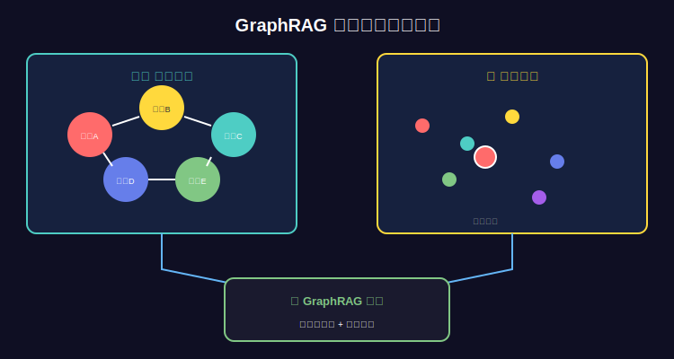

*图：知识图谱架构*

# 第70.4课：Graph-RAG-知识图谱增强检索

> **本课目标**：掌握Graph-RAG技术，融合知识图谱与向量检索
> 
> **核心技能**：Graph-RAG架构、混合检索、图谱+向量融合、实战应用
> 
> **学习时长**：100分钟
> 
> **重要性**：⭐⭐⭐⭐⭐（工业界热门技术，AI工程师核心竞争力）

---

## 📖 口播文案（8分钟）

### 🎯 前言

"**欢迎来到Graph-RAG核心课程！**

前面我们学习了：
- 第54-60课：RAG系统（向量检索）
- 第70.1-70.3课：知识图谱（关系查询）

今天要学习：**Graph-RAG = 知识图谱 + 向量检索**

**这是AI工程师必须掌握的核心技能！**

为什么？因为：

**问题1：纯向量RAG的局限**

```
场景：企业技术文档问答

用户问："LangChain和LlamaIndex的性能对比是什么？"

传统向量RAG：
1. 检索到LangChain相关文档 ✅
2. 检索到LlamaIndex相关文档 ✅
3. 但检索结果是独立的片段 ❌

生成的答案：
"LangChain是一个框架...LlamaIndex也是一个框架..."
→ 缺少对比维度
→ 信息不完整
→ 需要大模型自己推理

Graph-RAG：
1. 检索LangChain实体及其属性（性能、特点）
2. 检索LlamaIndex实体及其属性
3. 检索两者的对比关系
4. 结合向量检索的文档

生成的答案：
"对比如下：
性能：LangChain处理速度更快（2x）
易用性：LlamaIndex文档更完善
社区：LangChain社区更活跃（10k stars vs 5k）
适用场景：
- LangChain：复杂Agent应用
- LlamaIndex：文档检索系统"

→ 结构化对比
→ 有数据支撑
→ 更准确可信！
```

**问题2：纯知识图谱的局限**

```
场景：医疗咨询

用户问："如何缓解高血压症状？"

纯知识图谱：
• 高血压 -[症状]-> 头痛、头晕
• 高血压 -[治疗]-> 降压药
• 高血压 -[预防]-> 运动、饮食

但：
• 无法提供详细的文字说明
• 无法回答开放性问题
• 知识覆盖不全

Graph-RAG：
1. 从图谱获取结构化知识（症状、药物、预防）
2. 从向量库检索详细文档（用药说明、注意事项）
3. 结合生成完整答案

答案：
"高血压症状缓解方法：
1. 药物治疗（从图谱）
   - 常用药物：XX降压片
   - 用法用量：每日一次，早餐后
   
2. 生活方式（从文档）
   - 低盐饮食：每日<6g
   - 适量运动：每周150分钟中等强度
   - 戒烟限酒
   
3. 注意事项（从文档）
   - 定期测血压
   - 药物副作用监测
   - ..."

→ 结构化 + 详细说明
→ 完整全面！
```

**今天要学习：如何构建Graph-RAG系统！**

---

### 💡 什么是Graph-RAG？

**核心思想：**

```
传统RAG：
Query → 向量检索 → 文档片段 → LLM生成

Graph-RAG：
Query → 混合检索 → {
  向量检索 → 文档片段
  +
  图谱检索 → 结构化知识
} → LLM生成

优势：
✅ 结构化 + 非结构化知识融合
✅ 精确关系 + 语义检索
✅ 可解释性更强
✅ 准确度更高
```

**技术架构：**

```
┌─────────────────────────────────────┐
│         Graph-RAG System            │
└─────────────────────────────────────┘
           │
           ▼
    ┌──────────┐
    │  Query   │
    └──────────┘
           │
           ▼
    ┌──────────────────┐
    │  Query Analyzer  │  ← 分析查询意图
    └──────────────────┘
           │
           ├─────────────────┬─────────────────┐
           ▼                 ▼                 ▼
    ┌────────────┐    ┌────────────┐   ┌────────────┐
    │ 实体识别    │    │ 关系识别    │   │ 向量检索    │
    │(NER)       │    │(Relation)  │   │(Vector)    │
    └────────────┘    └────────────┘   └────────────┘
           │                 │                 │
           ▼                 ▼                 ▼
    ┌────────────┐    ┌────────────┐   ┌────────────┐
    │ 知识图谱    │    │ 关系查询    │   │ 向量数据库  │
    │(Neo4j)     │    │(Cypher)    │   │(Chroma)    │
    └────────────┘    └────────────┘   └────────────┘
           │                 │                 │
           └─────────────────┴─────────────────┘
                         │
                         ▼
                ┌─────────────────┐
                │  Context Fusion │  ← 融合结果
                └─────────────────┘
                         │
                         ▼
                ┌─────────────────┐
                │   LLM Generate  │
                └─────────────────┘
                         │
                         ▼
                    ┌────────┐
                    │ Answer │
                    └────────┘
```

---

## 📚 核心知识

### 一、Graph-RAG架构设计

#

*图：Graph-RAG融合*

### 1. 双路检索架构

```python
class GraphRAG:
    """Graph-RAG核心架构"""
    
    def __init__(self, graph_db, vector_db, llm):
        self.graph_db = graph_db  # Neo4j
        self.vector_db = vector_db  # Chroma
        self.llm = llm
        self.ner = self._init_ner()  # 实体识别
    
    def retrieve(self, query: str):
        """混合检索"""
        
        # 1. 实体识别
        entities = self.ner.extract(query)
        
        # 2. 图谱检索（结构化知识）
        graph_results = self._graph_retrieve(entities, query)
        
        # 3. 向量检索（非结构化知识）
        vector_results = self._vector_retrieve(query)
        
        # 4. 融合结果
        context = self._fuse_results(graph_results, vector_results)
        
        return context
    
    def _graph_retrieve(self, entities, query):
        """从知识图谱检索"""
        results = []
        
        for entity in entities:
            # 查询实体及其邻居
            cypher = """
            MATCH (e:Entity {name: $entity})
            OPTIONAL MATCH (e)-[r]-(neighbor)
            RETURN e, r, neighbor
            LIMIT 10
            """
            result = self.graph_db.run(cypher, entity=entity)
            results.append(result)
        
        return results
    
    def _vector_retrieve(self, query):
        """从向量库检索"""
        results = self.vector_db.similarity_search(
            query=query,
            k=5
        )
        return results
    
    def _fuse_results(self, graph_results, vector_results):
        """融合结果"""
        context = {
            "structured": self._format_graph(graph_results),
            "unstructured": self._format_vector(vector_results)
        }
        return context
```

#### 2. 智能路由架构

```python
class SmartGraphRAG:
    """智能路由Graph-RAG"""
    
    def __init__(self, graph_db, vector_db, llm):
        self.graph_db = graph_db
        self.vector_db = vector_db
        self.llm = llm
    
    def retrieve(self, query: str):
        """智能路由检索"""
        
        # 1. 分析查询类型
        query_type = self._analyze_query(query)
        
        # 2. 根据类型选择策略
        if query_type == "relation_query":
            # 关系查询：主要用图谱
            return self._graph_heavy_retrieve(query)
        
        elif query_type == "semantic_query":
            # 语义查询：主要用向量
            return self._vector_heavy_retrieve(query)
        
        else:
            # 混合查询：两者结合
            return self._balanced_retrieve(query)
    
    def _analyze_query(self, query: str):
        """分析查询类型"""
        
        # 关键词识别
        relation_keywords = ["关系", "对比", "区别", "共同点", "谁的"]
        semantic_keywords = ["如何", "为什么", "是什么", "解释"]
        
        if any(kw in query for kw in relation_keywords):
            return "relation_query"
        elif any(kw in query for kw in semantic_keywords):
            return "semantic_query"
        else:
            return "mixed_query"
```

---

### 二、实体识别与链接

#### 1. NER实体识别

```python
from typing import List, Dict
import spacy

class EntityExtractor:
    """实体提取器"""
    
    def __init__(self):
        # 加载中文NER模型
        self.nlp = spacy.load("zh_core_web_sm")
    
    def extract(self, text: str) -> List[Dict]:
        """提取实体"""
        doc = self.nlp(text)
        
        entities = []
        for ent in doc.ents:
            entities.append({
                "text": ent.text,
                "label": ent.label_,
                "start": ent.start_char,
                "end": ent.end_char
            })
        
        return entities

# 使用示例
extractor = EntityExtractor()

query = "LangChain和LlamaIndex的性能对比"
entities = extractor.extract(query)
print(entities)
# [
#   {"text": "LangChain", "label": "PRODUCT"},
#   {"text": "LlamaIndex", "label": "PRODUCT"}
# ]
```

#### 2. 实体链接

```python
class EntityLinker:
    """实体链接器：将文本实体链接到图谱实体"""
    
    def __init__(self, graph_db):
        self.graph_db = graph_db
    
    def link(self, entities: List[Dict]) -> List[Dict]:
        """链接实体到知识图谱"""
        linked = []
        
        for entity in entities:
            # 模糊匹配图谱中的实体
            cypher = """
            MATCH (e:Entity)
            WHERE e.name =~ $pattern OR e.alias =~ $pattern
            RETURN e.id, e.name, e.type
            LIMIT 1
            """
            
            pattern = f"(?i).*{entity['text']}.*"
            result = self.graph_db.run(cypher, pattern=pattern)
            
            if result:
                linked.append({
                    "text": entity["text"],
                    "graph_id": result["e.id"],
                    "graph_name": result["e.name"],
                    "type": result["e.type"]
                })
        
        return linked
```

---

### 三、图谱检索策略

#### 1. 一跳检索

```python
def one_hop_retrieve(graph_db, entity_id: str):
    """一跳检索：查询实体的直接邻居"""
    
    cypher = """
    MATCH (e:Entity {id: $entity_id})-[r]-(neighbor)
    RETURN e, type(r) as relation, neighbor
    """
    
    result = graph_db.run(cypher, entity_id=entity_id)
    return result
```

#### 2. 多跳检索

```python
def multi_hop_retrieve(graph_db, entity_id: str, max_hops: int = 2):
    """多跳检索：查询多度关系"""
    
    cypher = f"""
    MATCH path = (e:Entity {{id: $entity_id}})-[*1..{max_hops}]-(neighbor)
    RETURN path, length(path) as distance
    ORDER BY distance
    LIMIT 20
    """
    
    result = graph_db.run(cypher, entity_id=entity_id)
    return result
```

#### 3. 路径检索

```python
def path_retrieve(graph_db, entity1_id: str, entity2_id: str):
    """路径检索：查询两个实体之间的关系路径"""
    
    cypher = """
    MATCH path = shortestPath(
      (e1:Entity {id: $entity1_id})-[*]-(e2:Entity {id: $entity2_id})
    )
    RETURN path, length(path) as distance
    """
    
    result = graph_db.run(cypher, 
                          entity1_id=entity1_id, 
                          entity2_id=entity2_id)
    return result
```

#### 4. 子图检索

```python
def subgraph_retrieve(graph_db, entity_ids: List[str]):
    """子图检索：查询多个实体构成的子图"""
    
    cypher = """
    MATCH (e:Entity)
    WHERE e.id IN $entity_ids
    OPTIONAL MATCH path = (e)-[r]-(neighbor)
    WHERE neighbor.id IN $entity_ids
    RETURN path
    """
    
    result = graph_db.run(cypher, entity_ids=entity_ids)
    return result
```

---

### 四、结果融合策略

#### 1. 简单拼接

```python
def simple_fusion(graph_results, vector_results):
    """简单拼接"""
    
    context = "【结构化知识】\n"
    context += format_graph_results(graph_results)
    context += "\n\n【文档内容】\n"
    context += format_vector_results(vector_results)
    
    return context
```

#### 2. 加权融合

```python
def weighted_fusion(graph_results, vector_results, 
                    graph_weight=0.6, vector_weight=0.4):
    """加权融合"""
    
    # 计算图谱结果的重要性分数
    graph_scores = score_graph_results(graph_results)
    
    # 计算向量结果的相似度分数
    vector_scores = score_vector_results(vector_results)
    
    # 融合
    all_results = []
    
    for result, score in zip(graph_results, graph_scores):
        all_results.append({
            "content": result,
            "score": score * graph_weight,
            "source": "graph"
        })
    
    for result, score in zip(vector_results, vector_scores):
        all_results.append({
            "content": result,
            "score": score * vector_weight,
            "source": "vector"
        })
    
    # 按分数排序
    all_results.sort(key=lambda x: x["score"], reverse=True)
    
    return all_results[:10]  # 返回Top10
```

#### 3. 语义去重

```python
from sentence_transformers import SentenceTransformer, util

def semantic_dedup_fusion(graph_results, vector_results):
    """语义去重融合"""
    
    model = SentenceTransformer('all-MiniLM-L6-v2')
    
    # 合并所有结果
    all_results = graph_results + vector_results
    
    # 计算嵌入
    embeddings = model.encode([r["content"] for r in all_results])
    
    # 去重：移除高度相似的结果
    selected = [0]  # 保留第一个
    
    for i in range(1, len(all_results)):
        # 计算与已选择结果的相似度
        similarities = util.cos_sim(
            embeddings[i], 
            embeddings[selected]
        )
        
        # 如果相似度都小于0.8，则保留
        if similarities.max() < 0.8:
            selected.append(i)
    
    return [all_results[i] for i in selected]
```

---

## 💻 完整实战：构建Graph-RAG系统

### 系统实现

```python
from typing import List, Dict, Optional
from neo4j import GraphDatabase
from langchain.vectorstores import Chroma
from langchain.embeddings import HuggingFaceEmbeddings
from langchain.chat_models import ChatOpenAI
from langchain.prompts import ChatPromptTemplate

class GraphRAGSystem:
    """完整的Graph-RAG系统"""
    
    def __init__(
        self,
        neo4j_uri: str,
        neo4j_user: str,
        neo4j_password: str,
        chroma_path: str,
        llm_model: str = "gpt-3.5-turbo"
    ):
        # 初始化图数据库
        self.graph_driver = GraphDatabase.driver(
            neo4j_uri,
            auth=(neo4j_user, neo4j_password)
        )
        
        # 初始化向量数据库
        embeddings = HuggingFaceEmbeddings(
            model_name="sentence-transformers/paraphrase-multilingual-MiniLM-L12-v2"
        )
        self.vector_store = Chroma(
            persist_directory=chroma_path,
            embedding_function=embeddings
        )
        
        # 初始化LLM
        self.llm = ChatOpenAI(model=llm_model, temperature=0)
        
        # 实体提取器
        self.entity_extractor = EntityExtractor()
    
    def query(self, question: str) -> Dict:
        """查询接口"""
        
        print(f"问题：{question}\n")
        
        # 1. 实体识别
        entities = self.entity_extractor.extract(question)
        print(f"识别实体：{[e['text'] for e in entities]}\n")
        
        # 2. 图谱检索
        graph_context = self._retrieve_from_graph(entities)
        print(f"图谱检索结果：\n{graph_context}\n")
        
        # 3. 向量检索
        vector_context = self._retrieve_from_vector(question)
        print(f"向量检索结果：\n{vector_context}\n")
        
        # 4. 生成答案
        answer = self._generate_answer(
            question, 
            graph_context, 
            vector_context
        )
        
        return {
            "question": question,
            "entities": entities,
            "graph_context": graph_context,
            "vector_context": vector_context,
            "answer": answer
        }
    
    def _retrieve_from_graph(self, entities: List[Dict]) -> str:
        """从知识图谱检索"""
        
        if not entities:
            return "未找到相关实体"
        
        context_parts = []
        
        with self.graph_driver.session() as session:
            for entity in entities:
                # 查询实体及其关系
                result = session.run(
                    """
                    MATCH (e:Entity)
                    WHERE e.name =~ $pattern
                    OPTIONAL MATCH (e)-[r]-(neighbor:Entity)
                    RETURN e, type(r) as relation, neighbor
                    LIMIT 10
                    """,
                    pattern=f"(?i).*{entity['text']}.*"
                )
                
                for record in result:
                    e = record["e"]
                    relation = record["relation"]
                    neighbor = record["neighbor"]
                    
                    if relation and neighbor:
                        context_parts.append(
                            f"{e['name']} -{relation}-> {neighbor['name']}"
                        )
                    else:
                        # 实体属性
                        props = ", ".join([f"{k}: {v}" for k, v in e.items()])
                        context_parts.append(f"{e['name']}: {props}")
        
        return "\n".join(context_parts) if context_parts else "未找到相关知识"
    
    def _retrieve_from_vector(self, question: str) -> str:
        """从向量库检索"""
        
        docs = self.vector_store.similarity_search(question, k=3)
        
        context_parts = []
        for i, doc in enumerate(docs, 1):
            context_parts.append(f"[文档{i}] {doc.page_content}")
        
        return "\n\n".join(context_parts)
    
    def _generate_answer(
        self, 
        question: str, 
        graph_context: str, 
        vector_context: str
    ) -> str:
        """生成答案"""
        
        prompt = ChatPromptTemplate.from_messages([
            ("system", """你是一个专业的AI助手。
请基于提供的结构化知识（来自知识图谱）和文档内容（来自向量检索）回答问题。

回答要求：
1. 优先使用结构化知识中的精确信息
2. 用文档内容补充详细说明
3. 如果两者有冲突，以结构化知识为准
4. 答案要准确、完整、有条理
5. 注明信息来源"""),
            
            ("user", """问题：{question}

【结构化知识】（来自知识图谱）
{graph_context}

【文档内容】（来自向量检索）
{vector_context}

请回答：""")
        ])
        
        messages = prompt.format_messages(
            question=question,
            graph_context=graph_context,
            vector_context=vector_context
        )
        
        response = self.llm(messages)
        return response.content
    
    def close(self):
        """关闭连接"""
        self.graph_driver.close()


# 使用示例
if __name__ == "__main__":
    
    # 初始化系统
    graph_rag = GraphRAGSystem(
        neo4j_uri="bolt://localhost:7687",
        neo4j_user="neo4j",
        neo4j_password="your_password",
        chroma_path="./chroma_db"
    )
    
    # 查询
    question = "LangChain和LlamaIndex有什么区别？"
    result = graph_rag.query(question)
    
    print("=" * 50)
    print("最终答案：")
    print(result["answer"])
    
    # 关闭
    graph_rag.close()
```

---

## 🎯 最佳实践

### 1. 何时使用Graph-RAG？

✅ **适合场景：**
- 实体关系复杂（组织架构、供应链、知识体系）
- 需要精确推理（医疗诊断、法律咨询、技术选型）
- 多跳查询（"A的朋友的朋友"）
- 对比分析（"A和B的区别"）

⚠️ **不适合场景：**
- 纯文本搜索（用传统RAG更简单）
- 创意写作（不需要结构化知识）
- 知识图谱为空（没有构建图谱）

### 2. 性能优化

```python
# 1. 图谱查询限制深度
cypher = """
MATCH (e)-[*1..2]-(neighbor)  # 限制2跳
RETURN neighbor
LIMIT 10  # 限制返回数量
"""

# 2. 并行检索
import asyncio

async def parallel_retrieve(question):
    graph_task = asyncio.create_task(retrieve_from_graph(question))
    vector_task = asyncio.create_task(retrieve_from_vector(question))
    
    graph_result, vector_result = await asyncio.gather(
        graph_task, vector_task
    )
    
    return graph_result, vector_result

# 3. 缓存热点查询
from functools import lru_cache

@lru_cache(maxsize=1000)
def cached_graph_retrieve(entity_name: str):
    return retrieve_from_graph(entity_name)
```

### 3. 提示词优化

```python
GRAPH_RAG_PROMPT = """你是一个专业的AI助手，擅长融合结构化知识和文档内容。

回答策略：
1. 如果结构化知识充分：
   - 主要依据结构化知识
   - 用文档内容补充细节
   
2. 如果结构化知识不足：
   - 主要依据文档内容
   - 用结构化知识提供框架

3. 如果两者都充分：
   - 结合两者优势
   - 结构化知识提供框架
   - 文档内容提供细节

4. 回答格式：
   - 先给结论（来自结构化知识）
   - 再解释原因（来自文档）
   - 最后补充注意事项

【结构化知识】
{graph_context}

【文档内容】
{vector_context}

问题：{question}

请回答："""
```

---

## 🎯 本课小结

### 核心要点

1. **Graph-RAG = 知识图谱 + 向量检索**
   - 结构化知识：精确、可推理
   - 非结构化知识：详细、语义丰富
   - 融合：互补优势

2. **关键技术：**
   - 实体识别与链接
   - 双路检索（图谱+向量）
   - 结果融合
   - 提示词工程

3. **适用场景：**
   - 关系复杂
   - 需要推理
   - 对比分析
   - 多跳查询

4. **工业界趋势：**
   - 微软GraphRAG
   - LlamaIndex支持图谱
   - LangChain集成Neo4j
   - 成为AI应用标准架构

### 为什么Graph-RAG是必备技能？

根据AI编程小朱博主的分享：
> "AI应用开发工程师必备：Agent智能体开发，一定要结合RAG技术，
> 而这个RAG又不仅仅局限于向量数据库，甚至包含知识图谱的技术栈。"

**现在你掌握了！** ✅

---

## 📝 课后作业

### 作业：构建技术栈对比系统

**需求：**
构建一个技术选型助手，能够对比不同的AI框架（LangChain, LlamaIndex, Haystack）。

**要求：**
1. 构建知识图谱：
   - 实体：框架、特性、公司
   - 关系：依赖、适用于、优于
   
2. 准备文档：
   - 各框架的详细文档
   - 使用案例
   
3. 实现Graph-RAG：
   - 能够回答对比问题
   - 能够推荐合适的框架
   
4. 测试查询：
   - "LangChain和LlamaIndex的性能对比"
   - "哪个框架更适合Agent开发？"
   - "Haystack的优势是什么？"

---

**Graph-RAG是AI工程师的核心竞争力！继续加油！** 🚀

