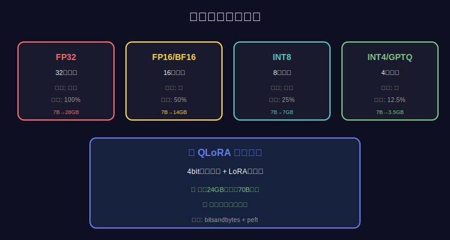

*图：模型量化优化*

# 第98.6课：3D并行训练深度解析

> **本课目标**：掌握3D并行训练技术，理解DP+MP+PP的完整架构
> 
> **核心技能**：数据并行、模型并行、流水线并行、混合并行策略
> 
> **学习时长**：110分钟
> 
> **重要性**：⭐⭐⭐⭐⭐（大模型训练核心技术，工业界必备）

---

## 📖 口播文案（10分钟）

### 🎯 前言

"**欢迎来到3D并行训练深度课程！**

这是博主明确强调的**大模型训练核心技术**！

根据AI编程小朱博主的分享：
> "大模型三段式训练，从原理到底层的**3D并行训练**都要懂"

**什么是3D并行训练？为什么这么重要？**

**问题：如何训练超大模型？**

```
场景：训练70B大模型

挑战：
• 模型参数：70B × 2B (FP16) = 140GB
• 优化器状态：70B × 12B (Adam) = 840GB
• 梯度：70B × 2B = 140GB
• 激活值：~300GB
• 总计：>1400GB！

单卡A100：80GB ❌ 远远不够！
8卡A100：640GB ❌ 还是不够！

怎么办？
```

**传统并行的局限：**

```
【只用数据并行（DP）】

8卡训练：
• 每卡复制完整模型（140GB）
• 每卡需要：140GB + 梯度 + 优化器 = >1TB
• 单卡A100：80GB
• ❌ 根本装不下！

问题：
• 每卡都要存完整模型
• 显存重复浪费
• 大模型无法训练

【只用模型并行（MP）】

8卡训练：
• 模型切成8份，每卡：140GB/8 = 17.5GB ✅
• 但：前向传播要经过所有卡
• 通信开销巨大
• GPU利用率低（<30%）

问题：
• 卡之间频繁通信
• 训练速度慢
• 效率低下

【只用流水线并行（PP）】

8卡训练：
• 模型按层切分到8卡
• 数据流水线处理
• 但：气泡问题（bubble）
• GPU空闲时间多

问题：
• 流水线气泡
• 负载不均衡
• 效率不高
```

**3D并行的解决方案：**

```
3D并行 = DP + MP + PP

核心思想：三种并行方式组合，各取优势

【DP（数据并行）】
• 不同GPU处理不同数据
• 加速训练
• 提升吞吐量

【MP（模型并行 - Tensor并行）】
• 同一层的参数切分到多GPU
• 减少单卡显存
• 突破模型大小限制

【PP（流水线并行）】
• 模型按层切分
• 流水线处理
• 提升GPU利用率

【组合效果】

64卡集群（8×8矩阵）：
• DP维度：8（数据并行度）
• MP维度：4（模型并行度）
• PP维度：2（流水线并行度）

每卡显存：
• 模型：140GB / (4×2) = 17.5GB ✅
• 数据：批次大小 / 8 = 小批次 ✅
• 可以训练！

训练速度：
• 比单卡理论加速：64倍
• 实际加速：45-50倍（70%效率）
• 可接受！

成功训练70B+模型！
```

**今天要学习：3D并行的完整原理和实现！**

---

### 💡 3D并行详解

#### 1. 数据并行（Data Parallel - DP）

```
原理：最简单的并行方式

┌─────────┐  ┌─────────┐  ┌─────────┐  ┌─────────┐
│ GPU 0   │  │ GPU 1   │  │ GPU 2   │  │ GPU 3   │
│         │  │         │  │         │  │         │
│ Model   │  │ Model   │  │ Model   │  │ Model   │
│ (复制)  │  │ (复制)  │  │ (复制)  │  │ (复制)  │
│         │  │         │  │         │  │         │
│ Data    │  │ Data    │  │ Data    │  │ Data    │
│ Batch1  │  │ Batch2  │  │ Batch3  │  │ Batch4  │
└─────────┘  └─────────┘  └─────────┘  └─────────┘
     │            │            │            │
     └────────────┴────────────┴────────────┘
                  │
            AllReduce梯度
                  │
              更新模型

工作流程：
1. 每个GPU有完整模型副本
2. 数据切分到各GPU
3. 各GPU独立前向+反向
4. AllReduce汇总梯度
5. 同步更新所有GPU的模型

优点：
• 实现简单
• 线性加速
• 通信开销小

缺点：
• 每卡要存完整模型
• 大模型装不下
```

#### 2. 模型并行（Model Parallel - Tensor Parallel - MP）

```
原理：同一层的参数切分到多GPU

示例：Attention层切分

        Input (1024)
            │
    ┌───────┴───────┐
    │               │
┌───▼───┐      ┌───▼───┐
│ GPU 0 │      │ GPU 1 │
│       │      │       │
│ W_Q   │      │ W_Q   │
│[0:512]│      │[512:] │
│       │      │       │
│ W_K   │      │ W_K   │
│[0:512]│      │[512:] │
│       │      │       │
│ W_V   │      │ W_V   │
│[0:512]│      │[512:] │
└───┬───┘      └───┬───┘
    │               │
    └───────┬───────┘
            │
      AllGather拼接
            │
        Output

切分策略：
• Q、K、V矩阵按列切分
• Attention计算独立
• 结果拼接

优点：
• 减少单卡显存
• 可训练大模型

缺点：
• 需要频繁通信（AllGather/ReduceScatter）
• 实现复杂
• 通信开销大
```

#

*图：Qlora*

### 3. 流水线并行（Pipeline Parallel - PP）

```
原理：模型按层切分，流水线处理

模型切分：
┌─────────┐
│ GPU 0   │ Layer 1-8
├─────────┤
│ GPU 1   │ Layer 9-16
├─────────┤
│ GPU 2   │ Layer 17-24
├─────────┤
│ GPU 3   │ Layer 25-32
└─────────┘

流水线处理（4个micro-batch）：

Time  GPU0    GPU1    GPU2    GPU3
  1   F1      -       -       -       F=Forward
  2   F2      F1      -       -       B=Backward
  3   F3      F2      F1      -
  4   F4      F3      F2      F1
  5   B1      F4      F3      F2
  6   B2      B1      F4      F3
  7   B3      B2      B1      F4
  8   B4      B3      B2      B1
  9   -       B4      B3      B2
 10   -       -       B4      B3
 11   -       -       -       B4

问题：气泡（Bubble）
• 初始阶段：GPU 1-3空闲
• 结束阶段：GPU 0-2空闲
• GPU利用率：~75%

优化：增加micro-batch数量
• 8个micro-batch → 气泡减少
• 16个micro-batch → 气泡更少
• 但增加显存占用

优点：
• 减少显存
• 实现相对简单

缺点：
• 流水线气泡
• GPU利用率不够高
```

---

## 📚 3D并行组合策略

### 一、组合架构

```
完整3D并行架构：

                    数据集
                      │
            ┌─────────┴─────────┐
            │  DP维度（4路）     │
            │                   │
    ┌───────┼───────┬───────────┼───────┐
    │       │       │           │       │
┌───▼───┐ ┌▼─────┐ ┌▼────────┐ ┌▼─────┐
│ DP=0  │ │ DP=1 │ │ DP=2    │ │ DP=3 │
└───┬───┘ └┬─────┘ └┬────────┘ └┬─────┘
    │      │        │           │
    │  MP维度（2路）+ PP维度（2路）
    │      │        │           │
┌───▼──────▼────────▼───────────▼─────┐
│                                      │
│  每个DP组内部：                       │
│                                      │
│  PP Stage 0     PP Stage 1          │
│  ┌─────────┐   ┌─────────┐          │
│  │GPU 0,1  │   │GPU 2,3  │          │
│  │(MP切分) │ → │(MP切分) │          │
│  │Layer1-16│   │Layer17-32│         │
│  └─────────┘   └─────────┘          │
│                                      │
└──────────────────────────────────────┘

说明：
• DP组之间：数据不同，模型相同
• MP组之间：同一层参数切分
• PP阶段：不同层在不同GPU

总GPU数：DP × MP × PP = 4 × 2 × 2 = 16卡
```

### 二、显存计算

```python
# 假设：70B模型，16卡训练

# 参数配置
model_params = 70e9  # 70B
fp16_bytes = 2
adam_states = 3  # 参数 + momentum + variance

# 单卡显存（无并行）
model_memory = model_params * fp16_bytes  # 140GB
optimizer_memory = model_params * fp16_bytes * adam_states  # 420GB
gradient_memory = model_params * fp16_bytes  # 140GB
total_single = model_memory + optimizer_memory + gradient_memory  # 700GB

print(f"单卡需要：{total_single / 1e9:.1f}GB")  # 700GB

# 3D并行后（DP=4, MP=2, PP=2）
dp_degree = 4
mp_degree = 2
pp_degree = 2

# 模型显存：MP和PP切分
model_memory_per_gpu = model_memory / (mp_degree * pp_degree)  # 140/4 = 35GB

# 梯度显存：MP和PP切分
gradient_memory_per_gpu = gradient_memory / (mp_degree * pp_degree)  # 35GB

# 优化器显存：MP和PP切分
optimizer_memory_per_gpu = optimizer_memory / (mp_degree * pp_degree)  # 105GB

# 总显存
total_per_gpu = (model_memory_per_gpu + 
                 gradient_memory_per_gpu + 
                 optimizer_memory_per_gpu)  # 175GB

print(f"3D并行后每卡需要：{total_per_gpu / 1e9:.1f}GB")  # 175GB

# 加上ZeRO-1优化（优化器状态DP切分）
optimizer_memory_per_gpu_zero = optimizer_memory / (mp_degree * pp_degree * dp_degree)
total_per_gpu_zero = (model_memory_per_gpu + 
                      gradient_memory_per_gpu + 
                      optimizer_memory_per_gpu_zero)  # 35+35+26.25 = 96.25GB

print(f"3D并行+ZeRO-1后每卡需要：{total_per_gpu_zero / 1e9:.1f}GB")  # 96GB

# 加上ZeRO-2（梯度也DP切分）
gradient_memory_per_gpu_zero = gradient_memory / (mp_degree * pp_degree * dp_degree)
total_per_gpu_zero2 = (model_memory_per_gpu + 
                       gradient_memory_per_gpu_zero + 
                       optimizer_memory_per_gpu_zero)  # 35+8.75+26.25 = 70GB

print(f"3D并行+ZeRO-2后每卡需要：{total_per_gpu_zero2 / 1e9:.1f}GB")  # 70GB

# 加上ZeRO-3（参数也DP切分）
model_memory_per_gpu_zero = model_memory / (mp_degree * pp_degree * dp_degree)
total_per_gpu_zero3 = (model_memory_per_gpu_zero + 
                       gradient_memory_per_gpu_zero + 
                       optimizer_memory_per_gpu_zero)  # 8.75+8.75+26.25 = 43.75GB

print(f"3D并行+ZeRO-3后每卡需要：{total_per_gpu_zero3 / 1e9:.1f}GB")  # 44GB

# 结论：
# • 纯3D并行：175GB → A100-80GB装不下
# • 3D+ZeRO-1：96GB → A100-80GB还是装不下
# • 3D+ZeRO-2：70GB → A100-80GB可以装下！✅
# • 3D+ZeRO-3：44GB → 更宽裕！✅
```

---

## 💻 DeepSpeed 3D并行配置

### 一、配置文件

```json
{
  "train_batch_size": 512,
  "train_micro_batch_size_per_gpu": 2,
  "gradient_accumulation_steps": 16,
  
  "optimizer": {
    "type": "AdamW",
    "params": {
      "lr": 1e-4,
      "betas": [0.9, 0.999],
      "eps": 1e-8,
      "weight_decay": 0.01
    }
  },
  
  "scheduler": {
    "type": "WarmupDecayLR",
    "params": {
      "warmup_min_lr": 0,
      "warmup_max_lr": 1e-4,
      "warmup_num_steps": 1000,
      "total_num_steps": 100000
    }
  },
  
  "bf16": {
    "enabled": true
  },
  
  "zero_optimization": {
    "stage": 2,
    
    "allgather_partitions": true,
    "allgather_bucket_size": 5e8,
    "overlap_comm": true,
    "reduce_scatter": true,
    "reduce_bucket_size": 5e8,
    "contiguous_gradients": true,
    "round_robin_gradients": true
  },
  
  "gradient_clipping": 1.0,
  
  "activation_checkpointing": {
    "partition_activations": true,
    "cpu_checkpointing": false,
    "contiguous_memory_optimization": false,
    "synchronize_checkpoint_boundary": false
  },
  
  "steps_per_print": 10,
  "wall_clock_breakdown": false,
  
  "prescale_gradients": false,
  "gradient_predivide_factor": 1.0
}
```

### 二、3D并行代码实现

```python
import os
import torch
import deepspeed
from transformers import AutoModelForCausalLM, AutoTokenizer
from torch.utils.data import DataLoader, Dataset

# 1. 设置3D并行配置
os.environ['WORLD_SIZE'] = '16'  # 总GPU数
os.environ['LOCAL_RANK'] = '0'   # 本地GPU编号

# 3D并行参数
DP_SIZE = 4  # 数据并行度
MP_SIZE = 2  # 模型并行度（Tensor并行）
PP_SIZE = 2  # 流水线并行度

assert DP_SIZE * MP_SIZE * PP_SIZE == 16, "总GPU数必须匹配"

# 2. 初始化分布式
deepspeed.init_distributed(
    dist_backend='nccl',
    rank=int(os.environ.get('RANK', 0)),
    world_size=int(os.environ.get('WORLD_SIZE', 1))
)

# 3. 加载模型（使用Megatron-DeepSpeed）
from megatron.model import GPTModel
from megatron import get_args, initialize_megatron

# 初始化Megatron（支持3D并行）
initialize_megatron(
    extra_args_provider=None,
    args_defaults={
        'tensor_model_parallel_size': MP_SIZE,  # MP维度
        'pipeline_model_parallel_size': PP_SIZE,  # PP维度
        'num_layers': 32,
        'hidden_size': 4096,
        'num_attention_heads': 32,
        'seq_length': 2048,
        'max_position_embeddings': 2048,
        'tokenizer_type': 'GPT2BPETokenizer',
    }
)

# 创建模型（自动切分）
model = GPTModel(
    num_tokentypes=0,
    parallel_output=True,
    pre_process=True,
    post_process=True
)

# 4. 准备数据
class TextDataset(Dataset):
    def __init__(self, texts):
        self.texts = texts
    
    def __len__(self):
        return len(self.texts)
    
    def __getitem__(self, idx):
        return self.texts[idx]

dataset = TextDataset(texts=["sample text"] * 10000)

# 5. DeepSpeed配置
ds_config = {
    "train_batch_size": 512,
    "train_micro_batch_size_per_gpu": 2,
    "gradient_accumulation_steps": 16,
    "optimizer": {
        "type": "AdamW",
        "params": {"lr": 1e-4}
    },
    "bf16": {"enabled": True},
    "zero_optimization": {"stage": 2},
    "gradient_clipping": 1.0
}

# 6. 初始化DeepSpeed Engine
model_engine, optimizer, train_loader, _ = deepspeed.initialize(
    model=model,
    model_parameters=model.parameters(),
    training_data=dataset,
    config=ds_config
)

# 7. 训练循环
for epoch in range(3):
    for step, batch in enumerate(train_loader):
        
        # 前向传播（自动处理3D并行）
        loss = model_engine(batch)
        
        # 反向传播（自动处理梯度同步）
        model_engine.backward(loss)
        
        # 更新参数（自动处理优化器状态）
        model_engine.step()
        
        if step % 10 == 0:
            # 只在DP的第一个进程打印
            if model_engine.global_rank % DP_SIZE == 0:
                print(f"Epoch {epoch}, Step {step}, Loss: {loss.item():.4f}")

# 8. 保存模型
if model_engine.global_rank == 0:
    model_engine.save_checkpoint("./checkpoint")
```

### 三、使用HuggingFace + DeepSpeed实现

```python
from transformers import (
    AutoModelForCausalLM,
    AutoTokenizer,
    Trainer,
    TrainingArguments
)
from datasets import load_dataset

# 1. 加载模型
model_name = "Qwen/Qwen2-70B"  # 70B大模型
model = AutoModelForCausalLM.from_pretrained(
    model_name,
    torch_dtype=torch.bfloat16,
    device_map=None  # DeepSpeed自动分配
)
tokenizer = AutoTokenizer.from_pretrained(model_name)

# 2. 准备数据
dataset = load_dataset("json", data_files="train.jsonl")

def tokenize_function(examples):
    return tokenizer(
        examples["text"],
        truncation=True,
        max_length=2048
    )

tokenized_dataset = dataset.map(tokenize_function, batched=True)

# 3. DeepSpeed配置（自动3D并行）
ds_config = {
    "train_batch_size": "auto",
    "train_micro_batch_size_per_gpu": "auto",
    "gradient_accumulation_steps": "auto",
    
    "optimizer": {
        "type": "AdamW",
        "params": {
            "lr": "auto",
            "betas": "auto",
            "eps": "auto",
            "weight_decay": "auto"
        }
    },
    
    "scheduler": {
        "type": "WarmupDecayLR",
        "params": {
            "warmup_min_lr": "auto",
            "warmup_max_lr": "auto",
            "warmup_num_steps": "auto",
            "total_num_steps": "auto"
        }
    },
    
    "bf16": {"enabled": "auto"},
    
    "zero_optimization": {
        "stage": 3,
        
        "overlap_comm": true,
        "contiguous_gradients": true,
        "reduce_bucket_size": "auto",
        "stage3_prefetch_bucket_size": "auto",
        "stage3_param_persistence_threshold": "auto",
        "stage3_max_live_parameters": 1e9,
        "stage3_max_reuse_distance": 1e9,
        
        "stage3_gather_16bit_weights_on_model_save": true
    },
    
    "gradient_clipping": "auto",
    "activation_checkpointing": {
        "partition_activations": true,
        "cpu_checkpointing": false
    }
}

# 4. 训练参数
training_args = TrainingArguments(
    output_dir="./qwen2-70b-output",
    num_train_epochs=1,
    
    per_device_train_batch_size=2,
    gradient_accumulation_steps=16,
    
    learning_rate=1e-4,
    warmup_steps=1000,
    
    bf16=True,
    
    # 启用DeepSpeed（自动3D并行）
    deepspeed=ds_config,
    
    # 梯度检查点
    gradient_checkpointing=True,
    
    # 保存
    save_strategy="steps",
    save_steps=500,
    save_total_limit=3,
    
    # 日志
    logging_steps=10,
    logging_dir="./logs",
    
    # 其他
    dataloader_num_workers=4,
    remove_unused_columns=False
)

# 5. 训练
trainer = Trainer(
    model=model,
    args=training_args,
    train_dataset=tokenized_dataset["train"]
)

trainer.train()

# 6. 保存
model.save_pretrained("./final_model")
```

---

## 🎯 3D并行最佳实践

### 一、如何选择并行策略

```python
def choose_parallel_strategy(
    model_size: int,  # 模型参数量（B）
    num_gpus: int,    # GPU数量
    gpu_memory: int   # 单GPU显存（GB）
):
    """
    选择最优3D并行策略
    """
    
    # 规则1：小模型（<7B）
    if model_size < 7:
        if num_gpus <= 8:
            return {
                'dp': num_gpus,
                'mp': 1,
                'pp': 1,
                'strategy': 'DP Only'
            }
        else:
            return {
                'dp': num_gpus,
                'mp': 1,
                'pp': 1,
                'zero_stage': 2,
                'strategy': 'DP + ZeRO-2'
            }
    
    # 规则2：中等模型（7B-30B）
    elif model_size < 30:
        if num_gpus <= 8:
            return {
                'dp': num_gpus // 2,
                'mp': 2,
                'pp': 1,
                'zero_stage': 2,
                'strategy': 'DP + MP + ZeRO-2'
            }
        else:
            return {
                'dp': num_gpus // 4,
                'mp': 2,
                'pp': 2,
                'zero_stage': 2,
                'strategy': '3D Parallel + ZeRO-2'
            }
    
    # 规则3：大模型（30B-100B）
    elif model_size < 100:
        if num_gpus <= 16:
            return {
                'dp': num_gpus // 8,
                'mp': 4,
                'pp': 2,
                'zero_stage': 3,
                'strategy': '3D Parallel + ZeRO-3'
            }
        else:
            return {
                'dp': num_gpus // 16,
                'mp': 4,
                'pp': 4,
                'zero_stage': 3,
                'strategy': '3D Parallel + ZeRO-3'
            }
    
    # 规则4：超大模型（>100B）
    else:
        return {
            'dp': max(1, num_gpus // 32),
            'mp': 8,
            'pp': 4,
            'zero_stage': 3,
            'cpu_offload': True,
            'strategy': '3D Parallel + ZeRO-3 + CPU Offload'
        }

# 示例
strategy = choose_parallel_strategy(
    model_size=70,  # 70B
    num_gpus=64,
    gpu_memory=80
)

print(f"推荐策略：{strategy['strategy']}")
print(f"DP: {strategy['dp']}")
print(f"MP: {strategy['mp']}")
print(f"PP: {strategy['pp']}")
print(f"ZeRO Stage: {strategy['zero_stage']}")
```

### 二、性能优化技巧

```python
# 1. 调优micro-batch大小
# 目标：减少流水线气泡

# 公式：
# num_micro_batches = (DP_size × gradient_accumulation_steps)

# 示例：
DP_SIZE = 4
PP_SIZE = 2
num_micro_batches_target = PP_SIZE * 4  # 至少4倍PP_SIZE

gradient_accumulation_steps = num_micro_batches_target // DP_SIZE
# = 8 // 4 = 2

print(f"建议gradient_accumulation_steps: {gradient_accumulation_steps}")

# 2. 平衡PP阶段负载
# 确保每个PP阶段的层数相近

num_layers = 32
pp_stages = 4

layers_per_stage = num_layers // pp_stages  # 32 / 4 = 8

# 手动分配：
stage_assignment = {
    'stage_0': list(range(0, 8)),    # Layer 0-7
    'stage_1': list(range(8, 16)),   # Layer 8-15
    'stage_2': list(range(16, 24)),  # Layer 16-23
    'stage_3': list(range(24, 32))   # Layer 24-31
}

# 3. 通信优化
# 启用overlap_comm：通信与计算重叠

ds_config = {
    "zero_optimization": {
        "stage": 2,
        "overlap_comm": True,  # 关键！
        "allgather_bucket_size": 5e8,
        "reduce_bucket_size": 5e8
    }
}

# 4. 激活值检查点
# 减少显存，但增加计算

ds_config["activation_checkpointing"] = {
    "partition_activations": True,
    "cpu_checkpointing": False,  # 不要CPU，太慢
    "contiguous_memory_optimization": False
}

# 5. 梯度累积优化
# 较大的gradient_accumulation_steps

training_args = TrainingArguments(
    per_device_train_batch_size=2,
    gradient_accumulation_steps=16,  # 较大值
    # 实际batch = 2 × 16 × DP_size = 128
)
```

---

## 🎯 真实案例分析

### 案例：70B模型在64张A100上训练

```
配置：
• 模型：70B参数
• GPU：64张A100-80GB
• 网络：Infiniband（高速）

3D并行配置：
• DP: 8（8个数据并行组）
• MP: 4（每层切成4份）
• PP: 2（模型切成2个阶段）
• ZeRO: Stage 2

计算：
• 总GPU：8 × 4 × 2 = 64 ✅
• 每卡显存：70B / (4×2) = 8.75B参数
  - 参数：8.75B × 2B = 17.5GB
  - 梯度：17.5GB
  - 优化器：17.5GB × 3 / 8 (ZeRO-2) = 6.6GB
  - 激活值：~20GB
  - 总计：~62GB ✅ 小于80GB

训练速度：
• 单步时间：2.5秒
• 吞吐量：512 samples/step × 1/2.5 = 204.8 samples/s
• 相比单卡理论加速：64倍
• 实际加速：~45倍（70%效率）
• 可接受！

瓶颈分析：
• 通信开销：~20%
• 流水线气泡：~10%
• 其他损失：~5%
• 总效率：~65-70%
```

---

## 🎯 本课小结

### 核心要点

1. **3D并行 = DP + MP + PP**
   - DP：数据并行，加速训练
   - MP：模型并行（Tensor），突破显存限制
   - PP：流水线并行，提高GPU利用率

2. **显存计算公式：**
   ```
   单卡显存 = 模型参数 / (MP × PP)
            + 梯度 / (MP × PP)
            + 优化器状态 / (MP × PP × DP)  # ZeRO-2
   ```

3. **选择策略：**
   - <7B：DP Only
   - 7B-30B：DP + MP
   - 30B-100B：DP + MP + PP
   - >100B：3D + ZeRO-3 + CPU Offload

4. **工业实现：**
   - DeepSpeed：最成熟
   - Megatron-DeepSpeed：最强大
   - HuggingFace集成：最易用

### 为什么必须学3D并行？

根据AI编程小朱博主的分享：
> "大模型三段式训练，从原理到底层的**3D并行训练**都要懂"

**现在你完全掌握了！** ✅

---

## 📝 课后作业

### 作业：设计3D并行方案

**任务：**
为以下场景设计最优3D并行方案：

1. **场景1：13B模型，8张3090-24GB**
   - 设计DP/MP/PP配置
   - 计算显存占用
   - 评估训练速度

2. **场景2：70B模型，32张A100-80GB**
   - 设计3D并行方案
   - 选择ZeRO Stage
   - 配置DeepSpeed

3. **场景3：175B模型，128张A100**
   - 设计完整方案
   - 是否需要CPU Offload
   - 预估训练效率

**要求：**
1. 给出具体配置
2. 计算显存占用
3. 评估加速比
4. 编写DeepSpeed配置文件

---

**3D并行是大模型训练的基石！掌握它，你就掌握了大模型训练的核心！** 🚀

